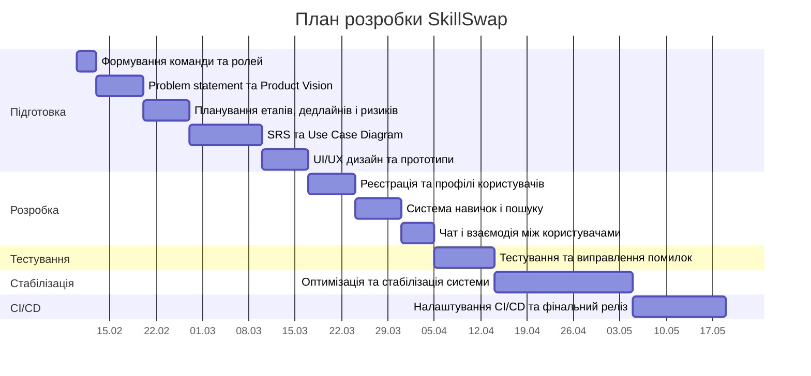

# Project planning and resource management

**Project:** SkillSwap  

**Duration:** 10.02.2026 – 19.05.2026

**Prepared by:** Olesia Baidala & Khrystyna Bat

**SkillSwap** — веб-застосунок для бартерного обміну навичками та послугами між людьми. План реалізації проєкту передбачає поетапну розробку системи: 
від аналізу вимог і проєктування до тестування та фінального розгортання.

## 1. Roadmap

| Stage | Main tasks | Period |
|-----|------|------|
| Ініціація проєкту | Формування команди, визначення ролей та зон відповідальності | 10.02 – 13.02 |
| Product Vision | Формулювання проблеми, цілей проєкту та Product Vision | 13.02 – 20.02 |
| Планування | Побудова плану реалізації, визначення етапів, дедлайнів та ризиків | 20.02 – 27.02 |
| Requirements Engineering | Підготовка SRS документації, Use Case Diagram | 27.02  – 10.03 |
| UI/UX дизайн | Створення wireframes та прототипів інтерфейсу | 10.03 – 17.03 |
| Основна розробка | Реалізація основного функціоналу системи | 17.03 – 05.04 |
| Тестування | Перевірка функціоналу та виправлення помилок | 05.04 – 14.04 |
| Оптимізація | Покращення стабільності системи та виправлення багів | 14.04 – 05.05 |
| Continuous Integration | Налаштування CI/CD та фінальна стабілізація системи | 05.05 – 19.05 |

## 2. Milestone Plan

| Milestone | Description | Date |
|-----------|-------------|------|
| M1 | Сформовано команду та визначено ролі | 13.02.2026 |
| M2 | Завершено Product Vision та планування проєкту | 27.02.2026 |
| M3 | Завершено SRS та Use Case Diagram | 10.03.2026 |
| M4 | Завершено UI/UX дизайн та створено прототипи | 17.03.2026 |
| M5 | Реалізовано систему реєстрації та профілів користувачів | 24.03.2026 |
| M6 | Реалізовано систему навичок та пошуку користувачів | 31.03.2026 |
| M7 | Реалізовано чат та взаємодію між користувачами | 05.04.2026 |
| M8 | Завершено тестування системи | 14.04.2026 |
| M9 | Проведено оптимізацію та виправлення критичних помилок | 05.05.2026 |
| M10 | Налаштовано CI/CD та фінальний реліз | 19.05.2026 |

## 3. Gantt Chart

## 4. Технологічні ресурси
- **Frontend:** Angular / TypeScript  
- **Backend:** .NET Core (C#)  
- **Database:** PostgreSQL  
- **Real-time communication:** SignalR  
- **Caching:** Redis  
- **Version Control:** GitHub  
- **Design:** Figma  
- **Containerization:** Docker  
- **Cloud services:** Azure Functions

## 5. Управління ризиками

| Risk | Description | Mitigation |
|-----|-------------|------------|
| Обмежені часові рамки | Стислі дедлайни можуть ускладнити реалізацію всіх запланованих функцій | Пріоритизація основного функціоналу та фокус на MVP |
| Складність інтеграції компонентів | Інтеграція frontend, backend та бази даних може викликати технічні труднощі | Поступова інтеграція модулів та регулярне тестування |
| Нестабільність чату в реальному часі | Реалізація миттєвого обміну повідомленнями може створювати додаткове навантаження на систему | Використання SignalR та оптимізація обробки повідомлень |
| Питання безпеки даних | Існує ризик несанкціонованого доступу до облікових записів користувачів | Використання HTTPS, хешування паролів та механізмів авторизації |
| Перевантаження системи | Велика кількість одночасних запитів може знизити продуктивність застосунку | Оптимізація запитів та використання кешування |
| Помилки у функціоналі | Під час розробки можуть виникати програмні помилки | Проведення code review та тестування перед інтеграцією |

## 6. Результат

Критеріями успішного завершення проєкту є:

- реалізована система реєстрації та авторизації користувачів
- користувачі можуть створювати та редагувати власні профілі
- реалізовано можливість додавання навичок та інтересів користувача.
- система дозволяє знаходити інших користувачів за навичками та інтересами
- реалізовано механізм комунікації між користувачами через внутрішній чат
- користувачі можуть підтверджувати обмін навичками та залишати відгуки
