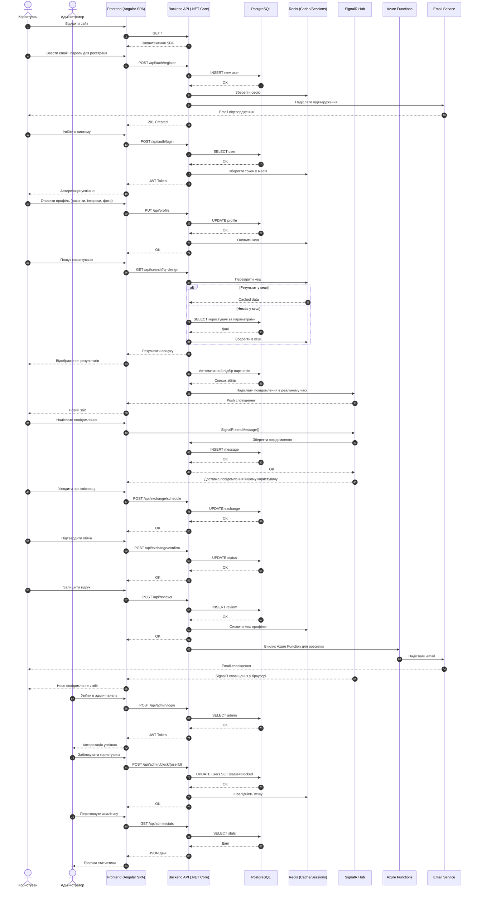
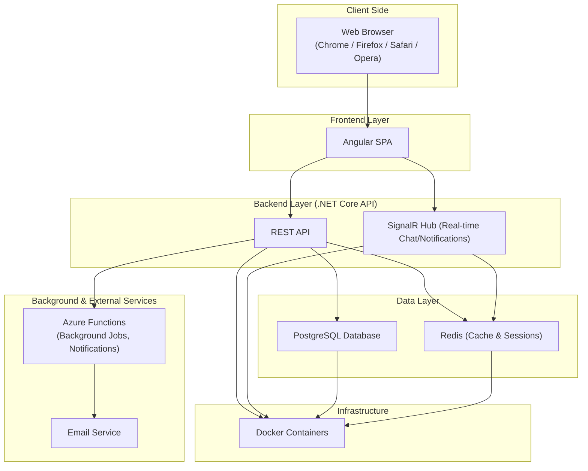
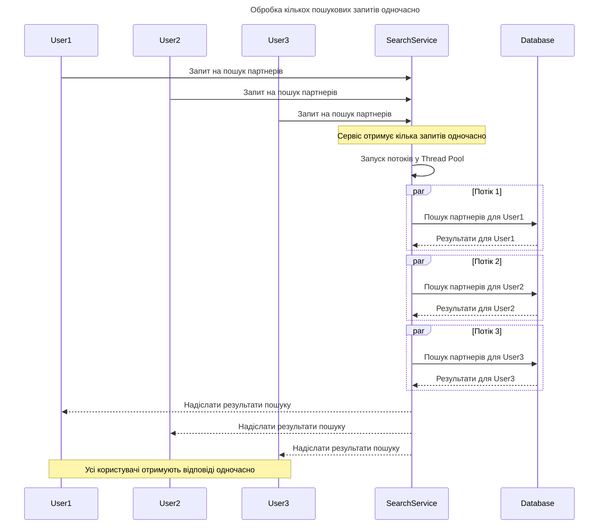
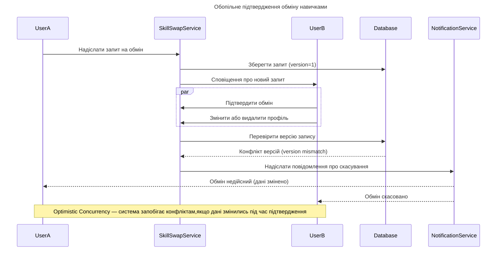
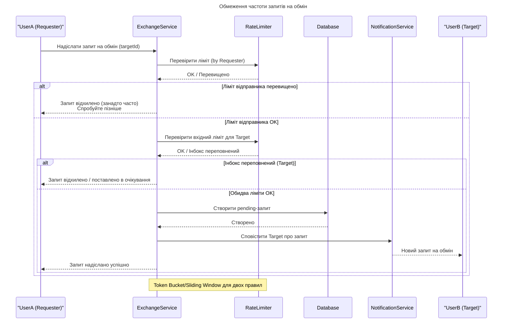
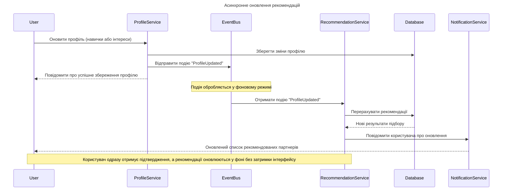
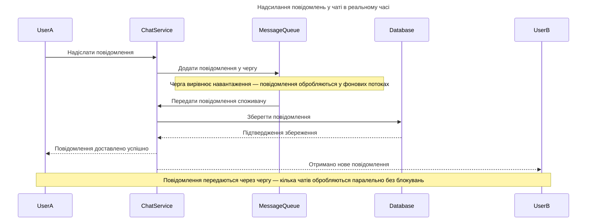
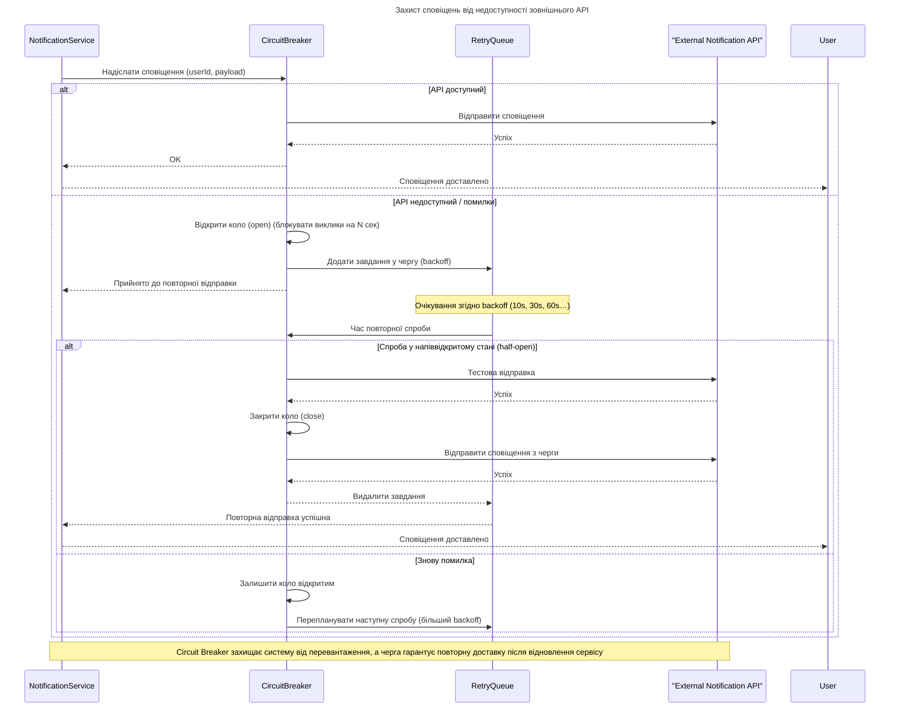

# Software Requirements Specification

**For:** SkillSwap

**Version:** 0.1

**Prepared by:** Olesia Baidala & Khrystyna Bat

## 1. Product Overview

### 1.1 Category of Product

Веб-застосунок для бартерного обміну навичками та послугами між людьми.

### 1.2 Purpose

Метою є дати людям можливість обмінюватися своїми навичками без використання грошей, сприяти розвитку співпраці, взаємодопомоги та неформального навчання.

### 1.3 Product Description

SkillSwap — це застосунок, що об’єднує людей, які хочуть обмінятися своїми навичками або послугами.
Кожен користувач створює персональний профіль, у якому може описати власні вміння, інтереси та потреби.
Система аналізує наявні пропозиції в базі даних і автоматично підбирає можливі поєднання, допомагаючи швидко знайти партнера для взаємного навчання чи обміну.
У застосунку реалізовано внутрішній чат для комунікації, можливість домовлятися про деталі співпраці, отримувати сповіщення про нові збіги та залишати відгуки після завершених обмінів.

### 1.4 Target Audience

Студенти, фрілансери, молоді спеціалісти, невеликі спільноти.

## 2. Actors / Personas

### 2.1 Regular User (Learner/Sharer)

**Опис:** людина, яка хоче навчитися новому або поділитися своїми навичками.

**Цілі**
* Знайти людину, яка навчить потрібної навички.
* Поділитися власними знаннями чи допомогти іншому.
* Отримати відгуки для підвищення репутації.

**Сценарії використання**
* Створює профіль і вказує власні навички.
* Шукає партнерів для обміну.
* Використовує чат для домовленостей.
* Залишає відгуки після обміну.

### 2.2 Moderator

**Опис:** відповідає за підтримку порядку у спільноті та має розширені права доступу.

**Цілі**
* Контролювати якість контенту та спілкування.
* Блокувати некоректних користувачів.
* Стежити за безпекою та дотриманням правил.

**Сценарії використання**
* Переглядає скарги користувачів.
* Видаляє або редагує профілі/повідомлення.
* Налаштовує загальні параметри системи (категорії навичок).

## 3. Functional Requirements

| ID    | Назва                            | Опис                                                                                                     |
|-------|----------------------------------|----------------------------------------------------------------------------------------------------------|
| FR01 | Реєстрація користувача           | Система повинна дозволяти новому користувачу створювати акаунт за допомогою email та пароля.             |
| FR02 | Вхід користувача                 | Система повинна дозволяти зареєстрованому користувачу входити в систему з правильними обліковими даними. |
| FR03 | Відновлення пароля               | Система повинна дозволяти користувачу відновити пароль через email.                                      |
| FR04 | Соціальний логін                 | Система може дозволяти користувачам входити через Google або Facebook.                                   |
| FR05 | Створення та редагування профілю | Система повинна дозволяти створювати й змінювати профіль.                                                |
| FR06 | Додавання навичок                | Система повинна дозволяти вказувати власні навички.                                                      |
| FR07 | Додавання інтересів              | Система повинна дозволяти зазначати навички чи послуги, які користувач хоче отримати.                    |
| FR08 | Завантаження аватарки            | Система повинна дозволяти завантажити фото профілю.                                                      |
| FR09 | Відображення відгуків            | Система повинна показувати рейтинг та відгуки у профілі.                                                 |
| FR10 | Пошук за ключовими словами       | Система повинна дозволяти пошук користувачів за ключовими словами.                                       |
| FR11 | Фільтрація пошуку                | Система повинна підтримувати фільтри (категорія, рівень навичок, місто).                                 |
| FR12 | Автоматичний підбір партнерів    | Система повинна рекомендувати потенційних партнерів.                                                     |
| FR13 | Сповіщення про збіги             | Система повинна інформувати користувача про нові збіги.                                                  |
| FR14 | Чат між користувачами            | Система повинна надавати можливість обміну повідомленнями в реальному часі.                              |
| FR15 | Надсилання файлів                | Система повинна дозволяти прикріплювати файли та зображення у чаті.                                      |
| FR16 | Домовленість про час             | Система повинна надавати інструмент для узгодження часу зустрічі чи заняття.                             |
| FR17 | Підтвердження обміну             | Система повинна вимагати підтвердження угоди обома сторонами.                                            |
| FR18 | Залишення відгуку                | Система повинна дозволяти залишати відгуки після завершення обміну.                                      |
| FR19 | Історія обмінів                  | Система повинна зберігати список завершених обмінів.                                                     |
| FR20 | Email-сповіщення                 | Система повинна надсилати повідомлення на email при нових збігах.                                        |
| FR21 | Сповіщення про повідомлення      | Система повинна інформувати користувача про нові повідомлення у чаті.                                    |
| FR22 | Редагування облікових даних      | Система повинна дозволяти змінювати email та пароль.                                                     |
| FR23 | Видалення акаунта                | Система повинна дозволяти користувачу видаляти свій акаунт.                                              |
| FR24 | Налаштування приватності         | Система повинна дозволяти обирати, які дані видно іншим.                                                 |
| FR25 | Блокування користувачів          | Адміністратор може блокувати небажаних користувачів.                                                     |
| FR26 | Модерація контенту               | Адміністратор може видаляти або редагувати неприйнятний контент.                                         |
| FR27 | Аналітика активності             | Система повинна мати панель для перегляду статистики (користувачі, обміни, скарги).                      |
| FR28 | Управління категоріями навичок   | Адміністратор може створювати та редагувати категорії навичок.                                           |

## 4. Non-Functional Requirements

| ID     | Назва             | Опис                                                                                           |
| ------ | ----------------- | ---------------------------------------------------------------------------------------------- |
| NFR01 | Простий інтерфейс | Інтерфейс має бути простим і зрозумілим (мінімум «зайвих кліків»).                             |
| NFR02 | Локалізація       | Система повинна підтримувати українську та англійську мови.                                    |
| NFR03 | Адаптивність      | Інтерфейс має бути придатним для мобільного браузера.                                          |
| NFR04 | Продуктивність    | Час відповіді на основні дії (вхід, пошук, повідомлення) — не більше 3 секунд.                 |
| NFR05 | Безпека паролів   | Паролі повинні зберігатися у вигляді хешів.                                                    |
| NFR06 | Шифрування        | Вхід у систему має відбуватися через HTTPS.                                                    |
| NFR07 | Доступність       | Система має бути доступною принаймні 90% часу (допускаються невеликі збої).                    |
| NFR08 | Логування         | У випадку помилок система повинна записувати повідомлення з датою та дією, яка викликала збій. |

## 5. Use Case Diagram

![Use Case Diagram](https://uml.planttext.com/plantuml/svg/fLPRJXj14Fn7yXr6V8KFNo72Pq0SO6KSOc4UCXlb8uhaHmH4Gd4K8IEXyB1yWMLjOB7nSeMU6wMwPyPUxsnCf012pBgwkgkwUvRDup1eXf_s6wMrHkr3gC93rQplVWpLJhrPguRrmuFIMcajg8Q7JRLELvJg5YMwhJkwIp55-dHT1STgUm7vIMDwqNsQwRx0MW1rE4o05MPZuk1Wjr43V63Ow85UA59RU_L6O-jpSBIklZ1IgQEWkXViClAE7lJ5dF84z3s5m4XHHB4mpF0xqT-GVE8GmgFmjQtAvVVg7LtYazQ2oQf07DDmM9TfDfQ3XaZGfsS3YvLkBuhMtHps5v1Zcb4AuiH4l4hEbARwV0MnFaLPA8sUE46gJ-28UV1eatpDMtBBj28Or0hbUzsXo7DWW6onHLhTzvGgoJJ6OPJrv3MR8LVy1IID7N36NG3ZAQf8LW1bCZf66FkuuRM7amiceiT5YQOYzd7YMNvhVHgXo1v2kxPHqWcMuqho3OIuCmQWBXRB0VUOcrR1t8obKsqedRVL1HSv3tIS7mrAiaZdY7LN1ZjBw-cyCH3UbBajl5lk0Sp7rfbEJkGnTaASvrsuV8CDqbvvQW7zBe4pB9WP04LFR0iC_ekFDnWXMNgxaJ428dq1xfHzAzZ3WRWzPPLksk09DhhBYu2pxkVglOPSvceZoZc7Hyyu9Yl2XYXb90EOk3MBT5lKSej4e1YK7oeU1baL7YuN3IAhj61mKOW-Sy3CzFtJk9hhagS3V_t899eFakVwm6-OvtE-oxNzeDue5_NwVyR3VWB1F7NJ9KglxA7n7CvEMPyXobo-pE7fk2kwdTYZgLptabu9OkQralTkRFlpnar_BR082zZ9NuE9FReNstcnEk_zPtYiJhCUiXOo1VdNL2KpJj06t2HRH-4Dlx4S-jkHvmBDlPlHN5bzVKPofyDUFd8PufiSOdw_IH7z7DULdpYIj2CxsJs8NtfTf7O_O2H-Dci7E_BF27__0G00)

## 6. Sequence Diagram

## 7. High-Level Architecture

### 7.1 Operating Environment

Операційне середовище для системи **SkillSwap**:

* **Архітектурний підхід:** клієнт–серверна система з розділенням на frontend (SPA) та backend (REST API).
* **Frontend:** Angular SPA, що виконується у браузері користувача.
* **Backend:** .NET Core (C#), реалізує REST API та SignalR для чату в реальному часі.
* **Database:** PostgreSQL – зберігання акаунтів, профілів, навичок, історії обмінів та відгуків.
* **Cache:** Redis – кеш пошукових запитів, зберігання сесій та токенів.
* **Message/Notification Layer:** SignalR (websocket) для push-повідомлень і миттєвого чату.
* **Клієнтське середовище:** сучасні браузери (Chrome, Firefox, Opera, Safari), адаптивна верстка для мобільних пристроїв.

### 7.2 Assumptions and Dependencies

Система розроблятиметься з використанням платформи **.NET Core** та мови програмування **C#**.

**Додаткові залежності**
* **Angular** — для створення односторінкового вебзастосунку (SPA).  
* **SignalR** — для реалізації чату та сповіщень у реальному часі.  
* **PostgreSQL** — для зберігання профілів користувачів, навичок і історії обмінів.  
* **Redis** — для кешування та зберігання сесій.  
* **Docker** — для контейнеризації та розгортання застосунку.  
* **Azure Functions** — для обробки сповіщень і виконання фонових завдань.

Фреймворк **Angular** забезпечує роботу застосунку без перезавантаження сторінки. Система буде доступною у браузерах **Chrome**, **Opera**, **Mozilla Firefox**, **Safari** та матиме адаптивний дизайн для смартфонів і планшетів.

## 8. Concurrency and Distributed Patterns

### 8.1 Обробка кількох пошукових запитів одночасно

Користувачі одночасно виконують пошук партнерів за навичками. Сервер обробляє їхні запити через пул потоків (**Thread Pool**), що дозволяє уникнути перевантаження системи та забезпечує швидке отримання результатів пошуку.

### 8.2 Обопільне підтвердження обміну навичками 

Користувачі одночасно виконують дії, пов’язані з підтвердженням обміну навичками. Якщо один користувач змінює або видаляє свій профіль під час очікування відповіді, система перевіряє актуальність даних перед підтвердженням угоди. У разі виявлення змін запит скасовується, а обидва користувачі отримують повідомлення про недійсність обміну. Такий підхід запобігає конфліктам даних і забезпечує узгодженість системи.

### 8.3 Обмеження частоти запитів на обмін 

Користувачі одночасно надсилають запити на обмін навичками. Система застосовує обмежувач частоти (**Rate Limiter**), який перевіряє кількість вихідних запитів від користувача та кількість вхідних запитів до адресата. Якщо ліміт перевищено — запит відхиляється або відкладається; якщо ні — створюється новий запис у базі даних і надсилається сповіщення адресату. Це запобігає спаму, перевантаженню сервера та забезпечує стабільну роботу системи під час великої кількості одночасних дій.

### 8.4 Асинхронне оновлення рекомендацій 

Коли користувач змінює свої навички або інтереси у профілі, система має оновити список рекомендованих партнерів. Щоб не затримувати користувача під час збереження профілю, ці обчислення виконуються **асинхронно**. Після збереження профілю створюється подія **ProfileUpdated**, яку перехоплює фоновий сервіс і у кількох потоках оновлює рекомендації, не блокуючи інтерфейс користувача. (Event-Driven / Async)

### 8.5 Надсилання повідомлень у чаті в реальному часі 

У системі **SkillSwap** користувачі спілкуються через чат у реальному часі. Коли багато користувачів одночасно надсилають повідомлення у різних чатах, сервер може бути перевантажений. Щоб уникнути затримок та втрати повідомлень під час пікових навантажень, застосовано патерн **Producer–Consumer**. Кожне повідомлення потрапляє до черги, де споживачі (серверні потоки) паралельно обробляють і доставляють його адресату. Це забезпечує стабільну роботу чату навіть при великій кількості активних діалогів.

### 8.6 Захист сповіщень від недоступності зовнішнього API 

Система надсилає сповіщення через зовнішній сервіс. Коли цей сервіс недоступний, **Circuit Breaker** тимчасово блокує виклики, а сповіщення ставляться у **чергу з експоненційною затримкою (Retry Queue)**. Після відновлення з’єднання коло знову відкривається, і накопичені повідомлення автоматично відправляються повторно. Такий підхід запобігає перевантаженню системи та гарантує доставку повідомлень після збою.

