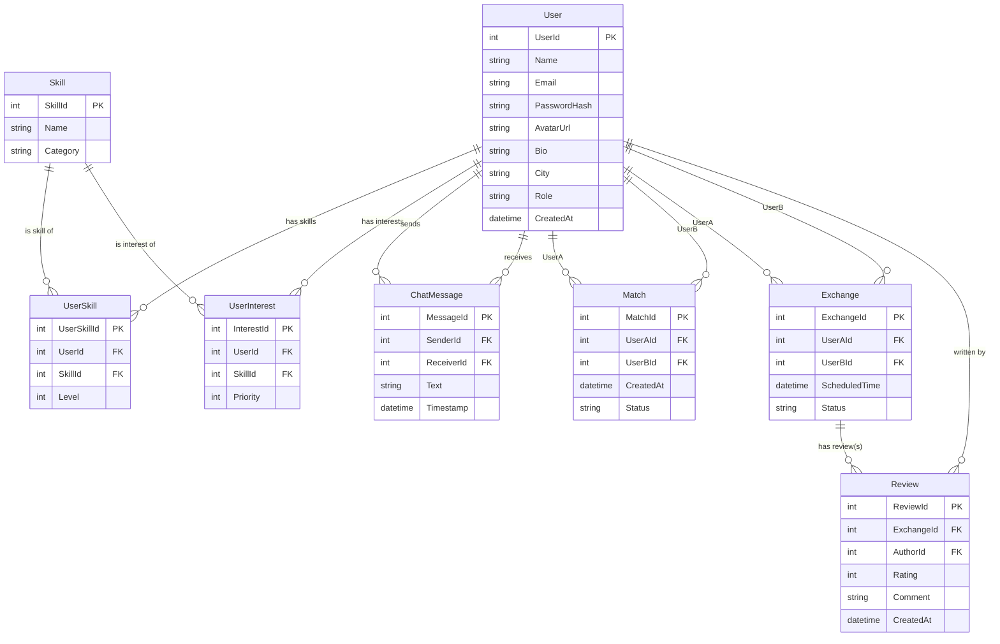

## Data model
### ER-діаграма та опис сутностей

#### User
Представляє зареєстрованого користувача системи.

Основні атрибути:
- UserId — унікальний ідентифікатор користувача.
- Name — ім’я, що відображається іншим користувачам.
- Email — унікальна адреса для входу.
- PasswordHash — захешований пароль.
- AvatarUrl — фото профілю.
- Bio — короткий опис користувача.
- City — локація для локальних обмінів.
- Role — user / admin.
- CreatedAt — дата створення акаунта.

#### Skill

Каталог навичок, які система підтримує.

Основні атрибути:
- SkillId — унікальний ідентифікатор навички.
- Name — назва навички (наприклад, “Python”, “Guitar”).
- Category — категорія (IT, Art, Languages, etc.).

#### UserSkill

Зв’язує користувача з навичками, які він може запропонувати іншим. Ця сутність відображає відношення багато-до-багатьох між User і Skill.

Основні атрибути:
- UserSkillId — ідентифікатор запису.
- UserId — FK на користувача.
- SkillId — FK на навичку.
- Level — рівень володіння (1–5).

#### UserInterest

Список навичок, які користувач хоче отримати від іншого користувача (запити). Також відношення багато-до-багатьох.

Основні атрибути:
- InterestId — ідентифікатор запису.
- UserId — FK на користувача.
- SkillId — FK на навичку.
- Priority — важливість (1–3).

#### Match

Представляє автоматичний або ручний збіг між двома користувачами. Використовується для нотифікацій та подальшої взаємодії.

Основні атрибути:
- MatchId — унікальний ідентифікатор збігу.
- UserAId, UserBId — користувачі, між якими стався збіг.
- CreatedAt — дата створення збігу.
- Status — pending / active / rejected / expired.

#### ChatMessage

Повідомлення між користувачами в чаті.

Основні атрибути:
- MessageId — унікальний ідентифікатор.
- SenderId — хто відправив.
- ReceiverId — кому відправили.
- Text — текст повідомлення.
- Timestamp — дата й час відправки.

#### Exchange

Представляє процес узгодженого обміну навичками.

Основні атрибути:
- ExchangeId — унікальний ідентифікатор.
- UserAId, UserBId — учасники обміну.
- ScheduledTime — узгоджений час.
- Status — requested / confirmed / completed / canceled.

#### Review

Відгук про обмін навичками.

Основні атрибути:
- ReviewId — унікальний ідентифікатор.
- ExchangeId — FK на завершений обмін.
- AuthorId — хто залишив відгук.
- Rating — оцінка (1–5).
- Comment — текст відгуку.
- CreatedAt — дата створення.
