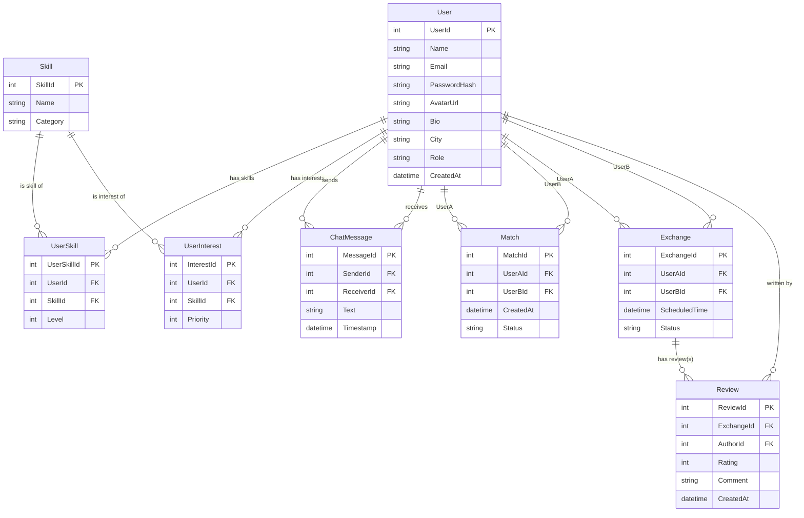
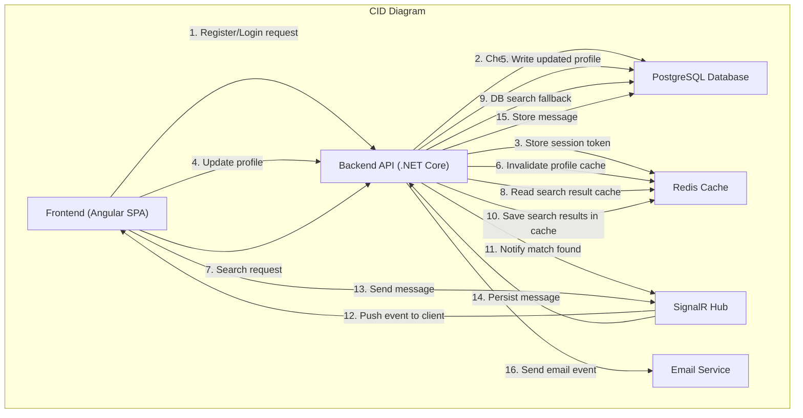

## Data model
### ER-діаграма та опис сутностей

#### User
Представляє зареєстрованого користувача системи.

Основні атрибути:
- UserId — унікальний ідентифікатор користувача.
- Name — ім’я, що відображається іншим користувачам.
- Email — унікальна адреса для входу.
- PasswordHash — захешований пароль.
- AvatarUrl — фото профілю.
- Bio — короткий опис користувача.
- City — локація для локальних обмінів.
- Role — user / admin.
- CreatedAt — дата створення акаунта.

#### Skill

Каталог навичок, які система підтримує.

Основні атрибути:
- SkillId — унікальний ідентифікатор навички.
- Name — назва навички (наприклад, “Python”, “Guitar”).
- Category — категорія (IT, Art, Languages, etc.).

#### UserSkill

Зв’язує користувача з навичками, які він може запропонувати іншим. Ця сутність відображає відношення багато-до-багатьох між User і Skill.

Основні атрибути:
- UserSkillId — ідентифікатор запису.
- UserId — FK на користувача.
- SkillId — FK на навичку.
- Level — рівень володіння (1–5).

#### UserInterest

Список навичок, які користувач хоче отримати від іншого користувача (запити). Також відношення багато-до-багатьох.

Основні атрибути:
- InterestId — ідентифікатор запису.
- UserId — FK на користувача.
- SkillId — FK на навичку.
- Priority — важливість (1–3).

#### Match

Представляє автоматичний або ручний збіг між двома користувачами. Використовується для нотифікацій та подальшої взаємодії.

Основні атрибути:
- MatchId — унікальний ідентифікатор збігу.
- UserAId, UserBId — користувачі, між якими стався збіг.
- CreatedAt — дата створення збігу.
- Status — pending / active / rejected / expired.

#### ChatMessage

Повідомлення між користувачами в чаті.

Основні атрибути:
- MessageId — унікальний ідентифікатор.
- SenderId — хто відправив.
- ReceiverId — кому відправили.
- Text — текст повідомлення.
- Timestamp — дата й час відправки.

#### Exchange

Представляє процес узгодженого обміну навичками.

Основні атрибути:
- ExchangeId — унікальний ідентифікатор.
- UserAId, UserBId — учасники обміну.
- ScheduledTime — узгоджений час.
- Status — requested / confirmed / completed / canceled.

#### Review

Відгук про обмін навичками.

Основні атрибути:
- ReviewId — унікальний ідентифікатор.
- ExchangeId — FK на завершений обмін.
- AuthorId — хто залишив відгук.
- Rating — оцінка (1–5).
- Comment — текст відгуку.
- CreatedAt — дата створення.

### Data Retention Policy

| Категорія даних                  | Тип даних                                     | Приклади                            | Строк зберігання                               | Примітки                              |
| -------------------------------- | --------------------------------------------- | ----------------------------------- | ---------------------------------------------- | ------------------------------------- |
| **Персональні дані користувача** | **PII**                                       | Ім’я, email, аватар, місто          | Поки акаунт активний + 30 днів після видалення | Потрібні для ідентифікації            |
| **Аутентифікаційні дані**        | **Sensitive Data**                            | PasswordHash, Refresh tokens        | Хеш пароля - безстроково; токени - 7-30 днів   | Критично для безпеки                  |
| **Профіль користувача**          | **Profile Data**                              | Bio, опис навичок, інтереси         | Поки акаунт існує                              | Інформація для пошуку та рекомендацій |
| **Каталог навичок**              | **Public Data**                               | Назви та категорії навичок          | Безстроково                                    | Не містить приватної інформації       |
| **UserSkill / UserInterest**     | **Behavioral Data**                           | Рівень навичок, пріоритет інтересів | Видаляються після видалення акаунта            | Особисті вподобання користувача       |
| **Збіги (Matches)**              | **Behavioral Data**                           | Пара користувачів, статус збігу     | 12 місяців                                     | Старі збіги не є цінними              |
| **Повідомлення чату**            | **Sensitive Content**                         | Текстові повідомлення               | 12 місяців                                     | Приватні дані користувачів            |
| **Обміни (Exchanges)**           | **Business Data**                             | Статус, учасники, час               | 24 місяці                                      | Ділова інформація про угоди           |
| **Відгуки**                      | **User-Generated Content**                    | Рейтинг, коментар                   | Безстроково (поки аккаунт існує)               | Частина репутації користувача         |
| **Сповіщення**                   | **Transient Data**                            | Email/push сповіщення               | 30 днів                                        | Тимчасові службові дані               |        |
| **Системні журнали**             | **Diagnostic Logs**                           | Помилки, виключення                 | 30–90 днів                                     | Використовується для підтримки        |
| **Кеш / Redis**                  | **Temporary Data**                            | Сесії, кеш пошуку                   | 1 год – 7 днів                                 | Автоматично очищується                |

## Resiliency model 
### CID diagram

### RMA workbook

#### 1. FE → API. Запит на автентифікацію

| Режим відмови                               | Наслідок                                   | Виявлення            | Відновлення / Пом’якшення                                       |
| ------------------------------------------- | ------------------------------------------ | -------------------- | --------------------------------------------------------------- |
| Затримка або timeout API                    | Користувач не може увійти                  | FE отримує 504       | Повторна спроба (retry); збільшений timeout на BE               |
| Некоректна обробка невірних даних           | Користувач бачить неправильне повідомлення | API повертає 400/401 | Уніфікація помилок FE/BE                                        |
| Немає доступу до Redis для збереження сесії | Сесія не створюється                       | API 500              | Повторна спроба + тимчасовий fallback на DB-only автентифікацію |

#### 2. API → DB. Запит на запис користувача

| Режим відмови              | Наслідок                               | Виявлення           | Відновлення                    |
| -------------------------- | -------------------------------------- | ------------------- | ------------------------------ |
| База даних недоступна      | Неможливо увійти                       | Помилка підключення | Retry з експоненційним backoff |
| Застарілі дані користувача | Користувач бачить неактуальний профіль | Перевірка версії    | Invalidation кешу              |
| Частковий запис профілю    | Дані пошкоджені                        | DB integrity error  | Відкат транзакції              |

#### 3. API → Redis. Збереження токена сесії

| Режим відмови              | Наслідок                        | Виявлення         | Відновлення                       |
| -------------------------- | ------------------------------- | ----------------- | --------------------------------- |
| Redis недоступний          | Сесія не створюється            | Error підключення | Тимчасова in-memory сесія         |
| Передчасне видалення ключа | Раптовий logout                 | Cache miss        | Перестворення ключа               |
| Неправильний TTL           | Сесія закінчується занадто рано | Перевірка TTL     | Автоматичне авто-встановлення TTL |

#### 4. FE → API. Оновлення профілю

| Режим відмови             | Наслідок                    | Виявлення      | Відновлення                          |
| ------------------------- | --------------------------- | -------------- | ------------------------------------ |
| Невалідні дані            | Профіль не оновився         | 400 validation | FE перевіряє форму перед надсиланням |
| Збій BE                   | Дані не записані            | 500            | Idempotent повторна спроба           |
| Занадто велике зображення | Запит завершується помилкою | FileTooLarge   | Компресія на FE                      |

#### 5. API → DB. Запис профілю

| Режим відмови         | Наслідок                        | Виявлення        | Відновлення                              |
| --------------------- | ------------------------------- | ---------------- | ---------------------------------------- |
| Конфлікт запису       | Профіль не оновлено             | Conflict         | Повторність через optimistic concurrency |
| Часткове оновлення    | Пошкоджені дані                 | Constraint error | Rollback транзакції                      |
| Неправильне кодування | Текст відображається некоректно | Encoding error   | Санітизація вводу                        |

#### 6. API → Redis. Інвалідація кешу профілю

| Режим відмови                     | Наслідок                     | Виявлення           | Відновлення                     |
| --------------------------------- | ---------------------------- | ------------------- | ------------------------------- |
| Ключ не видалений                 | FE бачить старий профіль     | Cache hit           | Примусове оновлення             |
| Видалено неправильний ключ        | Втрата кешованих даних       | Cache inconsistency | Автовідновлення кешу при запиті |
| Розподіл Redis розсинхронізований | Різні вузли повертають різне | Node mismatch       | Sticky reads                    |

#### 7. FE → API. Пошуковий запит

| Режим відмови        | Наслідок              | Виявлення   | Відновлення               |
| -------------------- | --------------------- | ----------- | ------------------------- |
| Запит занадто важкий | Довгий час очікування | Латентність | Timeout + підказки FE     |
| Неповні параметри    | Пошук не працює       | 400         | FE формує коректний запит |
| Перевищення ліміту   | Блокування запиту     | 429         | Backoff на FE             |

#### 8. API → Redis. Читання кешованого пошуку

| Режим відмови                  | Наслідок           | Виявлення           | Відновлення                |
| ------------------------------ | ------------------ | ------------------- | -------------------------- |
| Масовий cache miss             | Навантаження на DB | Miss pattern        | Soft TTL                   |
| Пошкоджені дані у кеші         | Некоректний список | JSON parse error    | Автоматичне очищення кешу  |
| Повільний Redis через failover | Затримки           | Моніторинг затримок | Перемикання на інший вузол |

#### 9. API → DB. Пошук у БД

| Режим відмови     | Наслідок        | Виявлення  | Відновлення             |
| ----------------- | --------------- | ---------- | ----------------------- |
| Query timeout     | Пошук зависає   | Slow query | Оптимізація й batching  |
| Локування таблиць | Затримки        | Lock log   | Зниження рівня ізоляції |
| Відсутні індекси  | Пошук повільний | Analyzer   | Побудова індексів       |

#### 10. API → Redis. Запис результатів пошуку

| Режим відмови               | Наслідок            | Виявлення   | Відновлення     |
| --------------------------- | ------------------- | ----------- | --------------- |
| Занадто великий ключ        | Не зберігається     | Redis error | Компресія       |
| Немає TTL                   | Кеш не очищається   | TTL check   | Призначення TTL |
| Евікція одразу після запису | Результати зникають | Miss        | Soft fallback   |

#### 11. API → SignalR. Публікація збігу

| Режим відмови                | Наслідок                  | Виявлення     | Відновлення                            |
| ---------------------------- | ------------------------- | ------------- | -------------------------------------- |
| Відсутнє підключення до хаба | Подія не доставлена       | Hub error     | Повторна відправка                     |
| Втрата повідомлення          | Користувач не бачить збіг | Delivery log  | Повторне надсилання після перевірки DB |
| Перевантаження SignalR       | Події сповільнені         | Queue backlog | Backpressure                           |

#### 12. SignalR → FE. Реальний час

| Режим відмови         | Наслідок          | Виявлення   | Відновлення                |
| --------------------- | ----------------- | ----------- | -------------------------- |
| FE не в мережі        | Подія втрачається | Unreachable | Позначити як «непрочитану» |
| Прострочений токен    | Клієнт відключено | Auth error  | Оновити токен              |
| Нестабільний інтернет | Розрив WebSocket  | Close event | Автопідключення            |

#### 13. FE → SignalR. Надсилання повідомлення

| Режим відмови             | Наслідок               | Виявлення         | Відновлення         |
| ------------------------- | ---------------------- | ----------------- | ------------------- |
| Повідомлення надто велике | Не надсилається        | Reject            | Компресія           |
| Дублювання                | Подвійний запис        | Sequence mismatch | Deduplication ID    |
| Втрата звʼязку            | Повідомлення «зависло» | Offline           | Місцева черга на FE |

#### 14. SignalR → API. Збереження повідомлення

| Режим відмови                | Наслідок                 | Виявлення      | Відновлення       |
| ---------------------------- | ------------------------ | -------------- | ----------------- |
| API недоступний              | Повідомлення не записане | Timeout        | Retry із backoff  |
| Неправильне кодування тексту | Символи пошкоджені       | Encoding error | Санітизація       |
| Дублікати                    | Подвійний запис          | DB conflict    | Idempotent insert |

#### 15. API → DB. Запис повідомлення у чаті

| Режим відмови      | Наслідок              | Виявлення  | Відновлення           |
| ------------------ | --------------------- | ---------- | --------------------- |
| Збій запису        | Повідомлення втрачено | DB error   | Retry                 |
| Гонка повідомлень  | Неправильний порядок  | Seq check  | Сортування на FE      |
| Закінчився простір | Немає запису          | Disk alert | Архівація або pruning |

