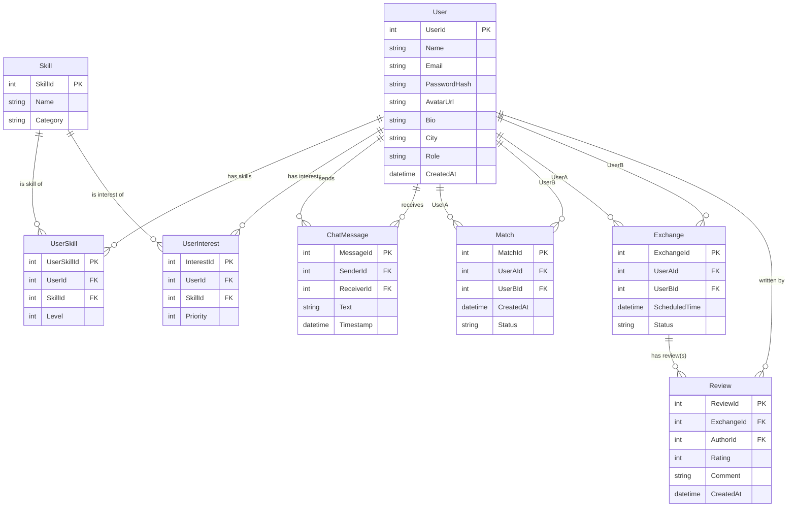
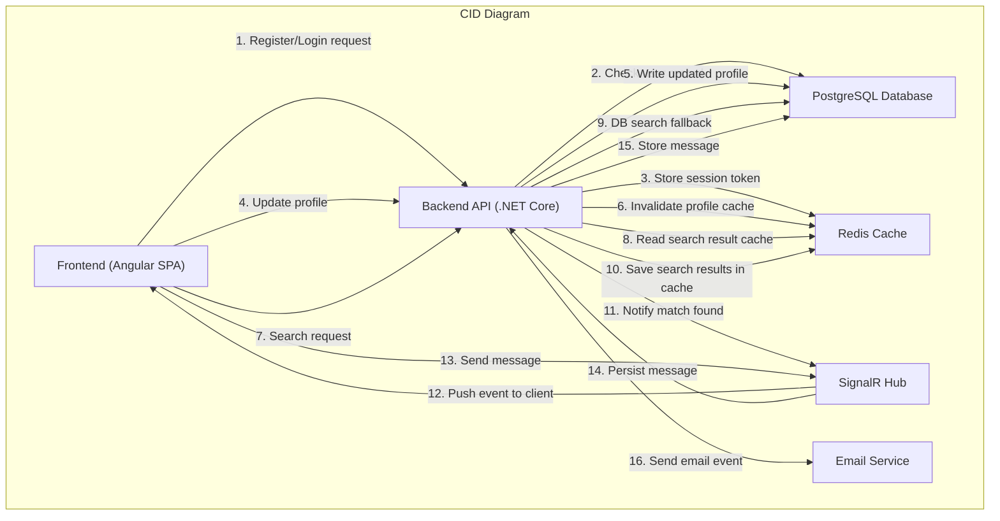

## Data model
### ER-діаграма та опис сутностей

```mermaid
erDiagram

    User {
        int UserId PK
        string Name
        string Email
        string PasswordHash
        string AvatarUrl
        string Bio
        string City
        string Role
        datetime CreatedAt
    }

    Skill {
        int SkillId PK
        string Name
        string Category
    }

    UserSkill {
        int UserSkillId PK
        int UserId FK
        int SkillId FK
        int Level
    }

    UserInterest {
        int InterestId PK
        int UserId FK
        int SkillId FK
        int Priority
    }

    Match {
        int MatchId PK
        int UserAId FK
        int UserBId FK
        datetime CreatedAt
        string Status
    }

    ChatMessage {
        int MessageId PK
        int SenderId FK
        int ReceiverId FK
        string Text
        datetime Timestamp
    }

    Exchange {
        int ExchangeId PK
        int UserAId FK
        int UserBId FK
        datetime ScheduledTime
        string Status
    }

    Review {
        int ReviewId PK
        int ExchangeId FK
        int AuthorId FK
        int Rating
        string Comment
        datetime CreatedAt
    }

    User ||--o{ UserSkill : "has skills"
    Skill ||--o{ UserSkill : "is skill of"

    User ||--o{ UserInterest : "has interests"
    Skill ||--o{ UserInterest : "is interest of"

    User ||--o{ ChatMessage : "sends"
    User ||--o{ ChatMessage : "receives"

    User ||--o{ Match : "UserA"
    User ||--o{ Match : "UserB"

    User ||--o{ Exchange : "UserA"
    User ||--o{ Exchange : "UserB"

    Exchange ||--o{ Review : "has review(s)"
    User ||--o{ Review : "written by"
```
#### User
Представляє зареєстрованого користувача системи.

Основні атрибути:
- UserId — унікальний ідентифікатор користувача.
- Name — ім’я, що відображається іншим користувачам.
- Email — унікальна адреса для входу.
- PasswordHash — захешований пароль.
- AvatarUrl — фото профілю.
- Bio — короткий опис користувача.
- City — локація для локальних обмінів.
- Role — user / admin.
- CreatedAt — дата створення акаунта.

#### Skill

Каталог навичок, які система підтримує.

Основні атрибути:
- SkillId — унікальний ідентифікатор навички.
- Name — назва навички (наприклад, “Python”, “Guitar”).
- Category — категорія (IT, Art, Languages, etc.).

#### UserSkill

Зв’язує користувача з навичками, які він може запропонувати іншим. Ця сутність відображає відношення багато-до-багатьох між User і Skill.

Основні атрибути:
- UserSkillId — ідентифікатор запису.
- UserId — FK на користувача.
- SkillId — FK на навичку.
- Level — рівень володіння (1–5).

#### UserInterest

Список навичок, які користувач хоче отримати від іншого користувача (запити). Також відношення багато-до-багатьох.

Основні атрибути:
- InterestId — ідентифікатор запису.
- UserId — FK на користувача.
- SkillId — FK на навичку.
- Priority — важливість (1–3).

#### Match

Представляє автоматичний або ручний збіг між двома користувачами. Використовується для нотифікацій та подальшої взаємодії.

Основні атрибути:
- MatchId — унікальний ідентифікатор збігу.
- UserAId, UserBId — користувачі, між якими стався збіг.
- CreatedAt — дата створення збігу.
- Status — pending / active / rejected / expired.

#### ChatMessage

Повідомлення між користувачами в чаті.

Основні атрибути:
- MessageId — унікальний ідентифікатор.
- SenderId — хто відправив.
- ReceiverId — кому відправили.
- Text — текст повідомлення.
- Timestamp — дата й час відправки.

#### Exchange

Представляє процес узгодженого обміну навичками.

Основні атрибути:
- ExchangeId — унікальний ідентифікатор.
- UserAId, UserBId — учасники обміну.
- ScheduledTime — узгоджений час.
- Status — requested / confirmed / completed / canceled.

#### Review

Відгук про обмін навичками.

Основні атрибути:
- ReviewId — унікальний ідентифікатор.
- ExchangeId — FK на завершений обмін.
- AuthorId — хто залишив відгук.
- Rating — оцінка (1–5).
- Comment — текст відгуку.
- CreatedAt — дата створення.

### Data Retention Policy

| Категорія даних                  | Тип даних                                     | Приклади                            | Строк зберігання                               | Примітки                              |
| -------------------------------- | --------------------------------------------- | ----------------------------------- | ---------------------------------------------- | ------------------------------------- |
| **Персональні дані користувача** | **PII**                                       | Ім’я, email, аватар, місто          | Поки акаунт активний + 30 днів після видалення | Потрібні для ідентифікації            |
| **Аутентифікаційні дані**        | **Sensitive Data**                            | PasswordHash, Refresh tokens        | Хеш пароля - безстроково; токени - 7-30 днів   | Критично для безпеки                  |
| **Профіль користувача**          | **Profile Data**                              | Bio, опис навичок, інтереси         | Поки акаунт існує                              | Інформація для пошуку та рекомендацій |
| **Каталог навичок**              | **Public Data**                               | Назви та категорії навичок          | Безстроково                                    | Не містить приватної інформації       |
| **UserSkill / UserInterest**     | **Behavioral Data**                           | Рівень навичок, пріоритет інтересів | Видаляються після видалення акаунта            | Особисті вподобання користувача       |
| **Збіги (Matches)**              | **Behavioral Data**                           | Пара користувачів, статус збігу     | 12 місяців                                     | Старі збіги не є цінними              |
| **Повідомлення чату**            | **Sensitive Content**                         | Текстові повідомлення               | 12 місяців                                     | Приватні дані користувачів            |
| **Обміни (Exchanges)**           | **Business Data**                             | Статус, учасники, час               | 24 місяці                                      | Ділова інформація про угоди           |
| **Відгуки**                      | **User-Generated Content**                    | Рейтинг, коментар                   | Безстроково (поки аккаунт існує)               | Частина репутації користувача         |
| **Сповіщення**                   | **Transient Data**                            | Email/push сповіщення               | 30 днів                                        | Тимчасові службові дані               |        |
| **Системні журнали**             | **Diagnostic Logs**                           | Помилки, виключення                 | 30–90 днів                                     | Використовується для підтримки        |
| **Кеш / Redis**                  | **Temporary Data**                            | Сесії, кеш пошуку                   | 1 год – 7 днів                                 | Автоматично очищується                |

## Resiliency model 
### CID diagram

```mermaid
flowchart TD

subgraph CID["CID Diagram"]
    FE["Frontend (Angular SPA)"]
    API["Backend API (.NET Core)"]
    DB["PostgreSQL Database"]
    RS["Redis Cache"]
    SG["SignalR Hub"]
    EM["Email Service"]
    
    %% User authentication
    FE -->|1. Register/Login request| API
    API -->|2. Check user record| DB
    API -->|3. Store session token| RS
    
    %% Profile update
    FE -->|4. Update profile| API
    API -->|5. Write updated profile| DB
    API -->|6. Invalidate profile cache| RS
    
    %% Searching and recommendations
    FE -->|7. Search request| API
    API -->|8. Read search result cache| RS
    API -->|9. DB search fallback| DB
    API -->|10. Save search results in cache| RS

    %% Real-time notifications
    API -->|11. Notify match found| SG
    SG -->|12. Push event to client| FE

    %% Chat messaging
    FE -->|13. Send message| SG
    SG -->|14. Persist message| API
    API -->|15. Store message| DB
    
    %% Email
    API -->|16. Send email event| EM
end
```

### RMA workbook

#### 1. FE → API. Запит на автентифікацію

| Режим відмови                               | Наслідок                                   | Виявлення            | Відновлення / Пом’якшення                                       |
| ------------------------------------------- | ------------------------------------------ | -------------------- | --------------------------------------------------------------- |
| Затримка або timeout API                    | Користувач не може увійти                  | FE отримує 504       | Повторна спроба (retry); збільшений timeout на BE               |
| Некоректна обробка невірних даних           | Користувач бачить неправильне повідомлення | API повертає 400/401 | Уніфікація помилок FE/BE                                        |
| Немає доступу до Redis для збереження сесії | Сесія не створюється                       | API 500              | Повторна спроба + тимчасовий fallback на DB-only автентифікацію |

#### 2. API → DB. Запит на запис користувача

| Режим відмови              | Наслідок                               | Виявлення           | Відновлення                    |
| -------------------------- | -------------------------------------- | ------------------- | ------------------------------ |
| База даних недоступна      | Неможливо увійти                       | Помилка підключення | Retry з експоненційним backoff |
| Застарілі дані користувача | Користувач бачить неактуальний профіль | Перевірка версії    | Invalidation кешу              |
| Частковий запис профілю    | Дані пошкоджені                        | DB integrity error  | Відкат транзакції              |

#### 3. API → Redis. Збереження токена сесії

| Режим відмови              | Наслідок                        | Виявлення         | Відновлення                       |
| -------------------------- | ------------------------------- | ----------------- | --------------------------------- |
| Redis недоступний          | Сесія не створюється            | Error підключення | Тимчасова in-memory сесія         |
| Передчасне видалення ключа | Раптовий logout                 | Cache miss        | Перестворення ключа               |
| Неправильний TTL           | Сесія закінчується занадто рано | Перевірка TTL     | Автоматичне авто-встановлення TTL |

#### 4. FE → API. Оновлення профілю

| Режим відмови             | Наслідок                    | Виявлення      | Відновлення                          |
| ------------------------- | --------------------------- | -------------- | ------------------------------------ |
| Невалідні дані            | Профіль не оновився         | 400 validation | FE перевіряє форму перед надсиланням |
| Збій BE                   | Дані не записані            | 500            | Idempotent повторна спроба           |
| Занадто велике зображення | Запит завершується помилкою | FileTooLarge   | Компресія на FE                      |

#### 5. API → DB. Запис профілю

| Режим відмови         | Наслідок                        | Виявлення        | Відновлення                              |
| --------------------- | ------------------------------- | ---------------- | ---------------------------------------- |
| Конфлікт запису       | Профіль не оновлено             | Conflict         | Повторність через optimistic concurrency |
| Часткове оновлення    | Пошкоджені дані                 | Constraint error | Rollback транзакції                      |
| Неправильне кодування | Текст відображається некоректно | Encoding error   | Санітизація вводу                        |

#### 6. API → Redis. Інвалідація кешу профілю

| Режим відмови                     | Наслідок                     | Виявлення           | Відновлення                     |
| --------------------------------- | ---------------------------- | ------------------- | ------------------------------- |
| Ключ не видалений                 | FE бачить старий профіль     | Cache hit           | Примусове оновлення             |
| Видалено неправильний ключ        | Втрата кешованих даних       | Cache inconsistency | Автовідновлення кешу при запиті |
| Розподіл Redis розсинхронізований | Різні вузли повертають різне | Node mismatch       | Sticky reads                    |

#### 7. FE → API. Пошуковий запит

| Режим відмови        | Наслідок              | Виявлення   | Відновлення               |
| -------------------- | --------------------- | ----------- | ------------------------- |
| Запит занадто важкий | Довгий час очікування | Латентність | Timeout + підказки FE     |
| Неповні параметри    | Пошук не працює       | 400         | FE формує коректний запит |
| Перевищення ліміту   | Блокування запиту     | 429         | Backoff на FE             |

#### 8. API → Redis. Читання кешованого пошуку

| Режим відмови                  | Наслідок           | Виявлення           | Відновлення                |
| ------------------------------ | ------------------ | ------------------- | -------------------------- |
| Масовий cache miss             | Навантаження на DB | Miss pattern        | Soft TTL                   |
| Пошкоджені дані у кеші         | Некоректний список | JSON parse error    | Автоматичне очищення кешу  |
| Повільний Redis через failover | Затримки           | Моніторинг затримок | Перемикання на інший вузол |

#### 9. API → DB. Пошук у БД

| Режим відмови     | Наслідок        | Виявлення  | Відновлення             |
| ----------------- | --------------- | ---------- | ----------------------- |
| Query timeout     | Пошук зависає   | Slow query | Оптимізація й batching  |
| Локування таблиць | Затримки        | Lock log   | Зниження рівня ізоляції |
| Відсутні індекси  | Пошук повільний | Analyzer   | Побудова індексів       |

#### 10. API → Redis. Запис результатів пошуку

| Режим відмови               | Наслідок            | Виявлення   | Відновлення     |
| --------------------------- | ------------------- | ----------- | --------------- |
| Занадто великий ключ        | Не зберігається     | Redis error | Компресія       |
| Немає TTL                   | Кеш не очищається   | TTL check   | Призначення TTL |
| Евікція одразу після запису | Результати зникають | Miss        | Soft fallback   |

#### 11. API → SignalR. Публікація збігу

| Режим відмови                | Наслідок                  | Виявлення     | Відновлення                            |
| ---------------------------- | ------------------------- | ------------- | -------------------------------------- |
| Відсутнє підключення до хаба | Подія не доставлена       | Hub error     | Повторна відправка                     |
| Втрата повідомлення          | Користувач не бачить збіг | Delivery log  | Повторне надсилання після перевірки DB |
| Перевантаження SignalR       | Події сповільнені         | Queue backlog | Backpressure                           |

#### 12. SignalR → FE. Реальний час

| Режим відмови         | Наслідок          | Виявлення   | Відновлення                |
| --------------------- | ----------------- | ----------- | -------------------------- |
| FE не в мережі        | Подія втрачається | Unreachable | Позначити як «непрочитану» |
| Прострочений токен    | Клієнт відключено | Auth error  | Оновити токен              |
| Нестабільний інтернет | Розрив WebSocket  | Close event | Автопідключення            |

#### 13. FE → SignalR. Надсилання повідомлення

| Режим відмови             | Наслідок               | Виявлення         | Відновлення         |
| ------------------------- | ---------------------- | ----------------- | ------------------- |
| Повідомлення надто велике | Не надсилається        | Reject            | Компресія           |
| Дублювання                | Подвійний запис        | Sequence mismatch | Deduplication ID    |
| Втрата звʼязку            | Повідомлення «зависло» | Offline           | Місцева черга на FE |

#### 14. SignalR → API. Збереження повідомлення

| Режим відмови                | Наслідок                 | Виявлення      | Відновлення       |
| ---------------------------- | ------------------------ | -------------- | ----------------- |
| API недоступний              | Повідомлення не записане | Timeout        | Retry із backoff  |
| Неправильне кодування тексту | Символи пошкоджені       | Encoding error | Санітизація       |
| Дублікати                    | Подвійний запис          | DB conflict    | Idempotent insert |

#### 15. API → DB. Запис повідомлення у чаті

| Режим відмови      | Наслідок              | Виявлення  | Відновлення           |
| ------------------ | --------------------- | ---------- | --------------------- |
| Збій запису        | Повідомлення втрачено | DB error   | Retry                 |
| Гонка повідомлень  | Неправильний порядок  | Seq check  | Сортування на FE      |
| Закінчився простір | Немає запису          | Disk alert | Архівація або pruning |

## Analytics model
### Таблиця аналітичної моделі
| Метрика                                                            | Вимірювання / Формат                                                                     | Пов’язана функціональність                                                         | Призначення (Insight)                                                                                                           |
| ------------------------------------------------------------------ | ---------------------------------------------------------------------------------------- | ----------------------------------------------------------------------------------------------------- | ------------------------------------------------------------------------------------------------------------------------------- |
| Кількість активних користувачів щодня (DAU)                        | int (кількість унікальних користувачів, що виконали хоча б одну дію за день)             | FR02 Вхід, FR05–FR07 робота з профілем, FR10–FR14 пошук та чат                                      | Базовий рівень залучення: чи повертаються користувачі та взаємодіють із ключовими функціями.                                    |
| Кількість нових реєстрацій на день                                 | int                                                                                      | FR01 Реєстрація, FR04 Соціальний логін                                                                | Вимірює ефективність залучення нових користувачів та вплив зовнішніх подій/кампаній на ріст аудиторії.                          |
| Частка користувачів із заповненим профілем                         | % (користувачі, які заповнили навички **та** інтереси протягом N годин після реєстрації) | FR05 Профіль, FR06 Навички, FR07 Інтереси                                                             | Показник “активації”: чи переходять нові користувачі від реєстрації до стану готовності шукати партнерів для обміну.            |
| Середня кількість навичок на активний профіль                      | float (навички / користувач)                                                             | FR06 Додавання навичок, FR28 Управління категоріями навичок                                     | Відображає рівень деталізації профілю та якість даних, що використовуються для рекомендацій.                                    |
| Середня кількість інтересів на профіль                             | float (інтереси / користувач)                                                            | FR07 Додавання інтересів                                                                              | Відображає чіткість запитів користувачів та потенційну кількість релевантних збігів.                                            |
| Кількість створених збігів на день (Match Count)                   | int (кількість записів Match за день)                                                    | FR10 Пошук, FR11 Фільтрація, FR12 Автоматичний підбір, FR13 Сповіщення про збіги                   | Показує, наскільки алгоритми пошуку та рекомендацій реально знаходять потенційних партнерів.                                    |
| Частка переглянутих збігів (Match View Rate)                       | % (користувачів зі збігами, які відкрили хоча б один)                                    | FR12 Автоматичний підбір, FR13 Сповіщення про збіги, FR09 Профіль із рейтингом                        | Оцінює зацікавленість користувачів у знайдених збігах та привабливість рекомендацій.                                            |
| Кількість створених обмінів на день (Exchange Count)               | int (Exchange зі статусом **requested** або **confirmed**)                               | FR16 Узгодження часу, FR17 Підтвердження обміну, FR19 Історія обмінів                             | Вимірює, скільки збігів переходять у реальні домовленості про співпрацю.                                                        |
| Частка завершених обмінів (Exchange Completion Rate)               | % (completed / (requested + confirmed))                                                  | FR17 Підтвердження обміну, FR19 Історія обмінів, FR18 Відгуки                                     | Показує, чи доходять користувачі до фактичного завершення співпраці, чи процес десь блокується.                                 |
| Середня кількість повідомлень у чаті на один збіг / обмін          | float (messages per match/exchange)                                                      | FR14 Чат, FR15 Надсилання файлів                                                                      | Відображає глибину комунікації між користувачами: чи реально спілкуються, чи обмежуються лише фактом збігу.                     |
| Середній рейтинг після обміну                                      | float (1–5)                                                                              | FR18 Залишення відгуку, FR09 Відображення відгуків, FR19 Історія обмінів                             | Показник якості обмінів та задоволеності користувачів від співпраці.                                                            |
| Частка користувачів, які мають хоча б один відгук                  | % профілів із ≥1 Review                                                                  | FR18 Відгуки, FR09 Профіль, FR19 Історія обмінів                                                      | Показує, чи формується в системі репутація і наскільки часто користувачі залишають зворотний зв’язок.                           |
| Частка відкритих сповіщень (Notification Open Rate)                | % (відкриті / надіслані)                                                                 | FR13 Сповіщення про збіги, FR20 Email-сповіщення, FR21 Сповіщення про повідомлення                 | Оцінює ефективність каналів сповіщень та текстів повідомлень, а також те, чи допомагають вони повертати користувачів у систему. |
| Кількість скарг на 100 активних користувачів (Complaint Rate)      | float (скарги / 100 DAU)                                                                 | FR25 Блокування користувачів, FR26 Модерація контенту, FR27 Аналітика активності                   | Відображає рівень проблемної поведінки в системі та навантаження на модерацію, сигналізує про можливі зловживання.              |

### Funnel 1: Процес переходу від збігу до обміну

**Мета:** відстежити, як користувачі проходять шлях від отримання збігу до завершення обміну навичками.

#### Кроки
1. **Отримав збіг (Match)**  
   (автоматичний підбір або результат пошуку за навичками)
2. **Переглянув збіг**  
   (переглянув навички партнера та відкрив його профіль)
3. **Почав листування у чаті**  
   (ініціював комунікацію з потенційним партнером)
4. **Створив обмін (Exchange) зі статусом _requested_**  
   (користувач надіслав запит на обмін)
5. **Партнер підтвердив обмін (_confirmed_)**  
   (друга сторона прийняла запит на обмін)
6. **Обмін завершено (_completed_)**  
   (обмін виконано відповідно до узгоджених умов)
7. **Користувач залишив відгук**  
   (користувач оцінив обмін)

#### Використані метрики
- **Кількість створених збігів на день (Match Count)** — метрика №6  
- **Частка переглянутих збігів (Match View Rate)** — метрика №7  
- **Середня кількість повідомлень у чаті на один збіг / обмін** — метрика №10  
- **Кількість створених обмінів на день (Exchange Count)** — метрика №8  
- **Частка завершених обмінів (Exchange Completion Rate)** — метрика №9  
- **Середній рейтинг після обміну** — метрика №11

### Funnel 2: Вплив сповіщень на повернення користувачів

**Мета:** оцінити, як сповіщення (про нові збіги, нові повідомлення та оновлення обміну) впливають на повернення користувачів у застосунок та їхню подальшу активність.

#### Кроки
1. **Система згенерувала сповіщення**  
   (новий збіг, нове повідомлення в чаті або оновлення статусу обміну)
2. **Сповіщення доставлено користувачу**  
   (email / push / in-app)
3. **Користувач відкрив сповіщення та перейшов у застосунок**  
   (користувач перейшов у застосунок у відповідь на отримане сповіщення)
4. **Користувач переглянув пов’язаний контент**  
   (збіг, чат або сторінку обміну)
5. **Користувач виконав дію**  
   (написав повідомлення, створив Exchange або підтвердив статус обміну _confirmed_)

#### Використані метрики
- **Частка відкритих сповіщень (Notification Open Rate)** — метрика №13  
- **Кількість активних користувачів щодня (DAU)** — метрика №1  
- **Кількість створених збігів на день (Match Count)** — метрика №6  
- **Частка переглянутих збігів (Match View Rate)** — метрика №7  
- **Середня кількість повідомлень у чаті на один збіг / обмін** — метрика №10  
- **Кількість створених обмінів на день (Exchange Count)** — метрика №8  
- **Частка завершених обмінів (Exchange Completion Rate)** — метрика №9  

