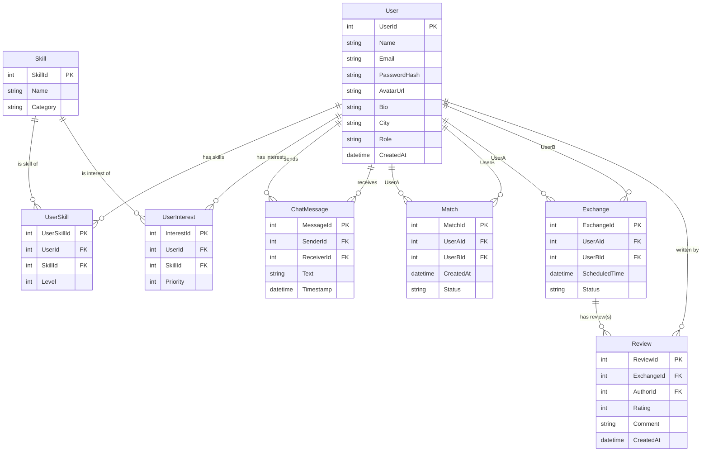
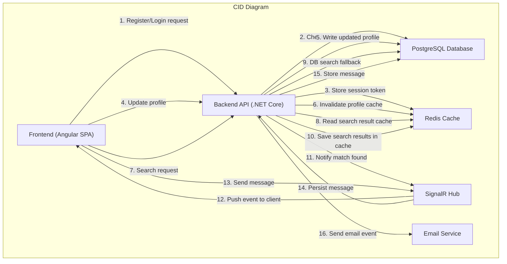
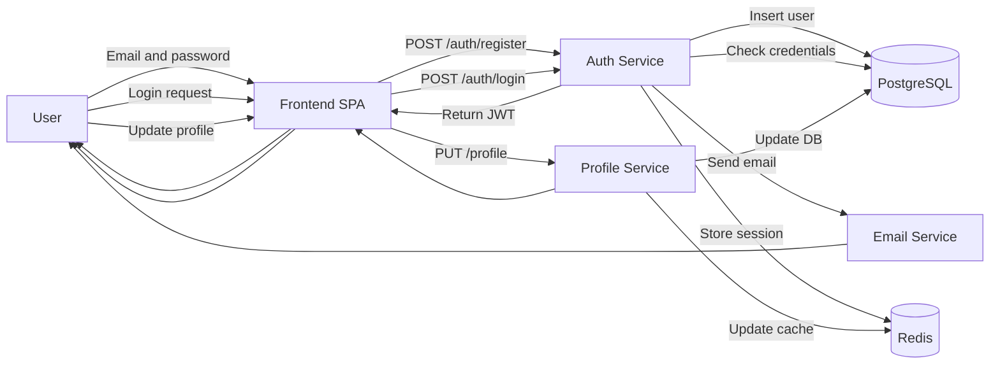
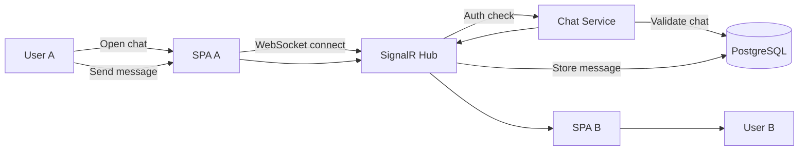
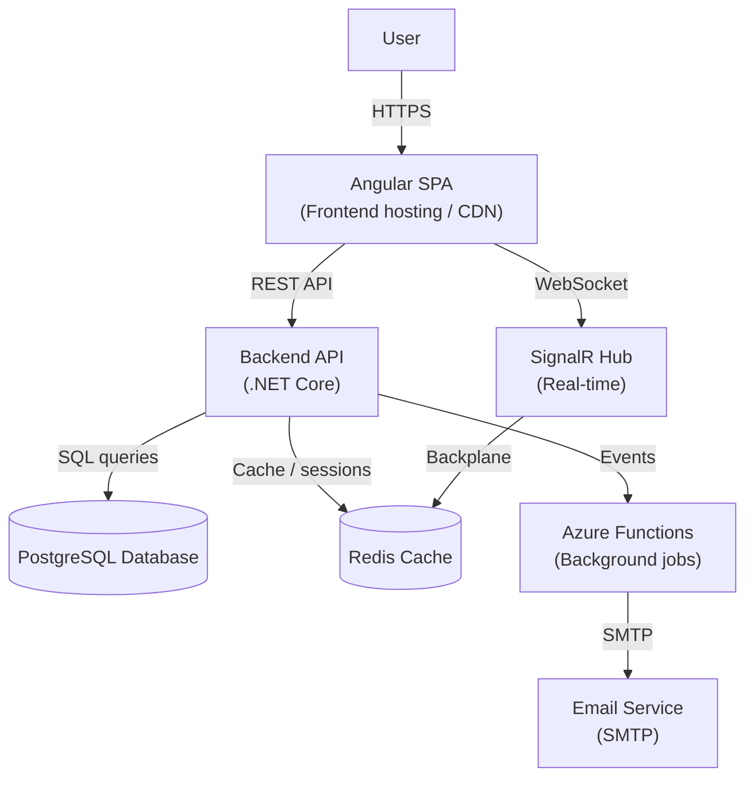

## Data model
### ER-діаграма та опис сутностей

```mermaid
erDiagram

    User {
        int UserId PK
        string Name
        string Email
        string PasswordHash
        string AvatarUrl
        string Bio
        string City
        string Role
        datetime CreatedAt
    }

    Skill {
        int SkillId PK
        string Name
        string Category
    }

    UserSkill {
        int UserSkillId PK
        int UserId FK
        int SkillId FK
        int Level
    }

    UserInterest {
        int InterestId PK
        int UserId FK
        int SkillId FK
        int Priority
    }

    Match {
        int MatchId PK
        int UserAId FK
        int UserBId FK
        datetime CreatedAt
        string Status
    }

    ChatMessage {
        int MessageId PK
        int SenderId FK
        int ReceiverId FK
        string Text
        datetime Timestamp
    }

    Exchange {
        int ExchangeId PK
        int UserAId FK
        int UserBId FK
        datetime ScheduledTime
        string Status
    }

    Review {
        int ReviewId PK
        int ExchangeId FK
        int AuthorId FK
        int Rating
        string Comment
        datetime CreatedAt
    }

    User ||--o{ UserSkill : "has skills"
    Skill ||--o{ UserSkill : "is skill of"

    User ||--o{ UserInterest : "has interests"
    Skill ||--o{ UserInterest : "is interest of"

    User ||--o{ ChatMessage : "sends"
    User ||--o{ ChatMessage : "receives"

    User ||--o{ Match : "UserA"
    User ||--o{ Match : "UserB"

    User ||--o{ Exchange : "UserA"
    User ||--o{ Exchange : "UserB"

    Exchange ||--o{ Review : "has review(s)"
    User ||--o{ Review : "written by"
```
#### User
Представляє зареєстрованого користувача системи.

Основні атрибути:
- UserId — унікальний ідентифікатор користувача.
- Name — ім’я, що відображається іншим користувачам.
- Email — унікальна адреса для входу.
- PasswordHash — захешований пароль.
- AvatarUrl — фото профілю.
- Bio — короткий опис користувача.
- City — локація для локальних обмінів.
- Role — user / admin.
- CreatedAt — дата створення акаунта.

#### Skill

Каталог навичок, які система підтримує.

Основні атрибути:
- SkillId — унікальний ідентифікатор навички.
- Name — назва навички (наприклад, “Python”, “Guitar”).
- Category — категорія (IT, Art, Languages, etc.).

#### UserSkill

Зв’язує користувача з навичками, які він може запропонувати іншим. Ця сутність відображає відношення багато-до-багатьох між User і Skill.

Основні атрибути:
- UserSkillId — ідентифікатор запису.
- UserId — FK на користувача.
- SkillId — FK на навичку.
- Level — рівень володіння (1–5).

#### UserInterest

Список навичок, які користувач хоче отримати від іншого користувача (запити). Також відношення багато-до-багатьох.

Основні атрибути:
- InterestId — ідентифікатор запису.
- UserId — FK на користувача.
- SkillId — FK на навичку.
- Priority — важливість (1–3).

#### Match

Представляє автоматичний або ручний збіг між двома користувачами. Використовується для нотифікацій та подальшої взаємодії.

Основні атрибути:
- MatchId — унікальний ідентифікатор збігу.
- UserAId, UserBId — користувачі, між якими стався збіг.
- CreatedAt — дата створення збігу.
- Status — pending / active / rejected / expired.

#### ChatMessage

Повідомлення між користувачами в чаті.

Основні атрибути:
- MessageId — унікальний ідентифікатор.
- SenderId — хто відправив.
- ReceiverId — кому відправили.
- Text — текст повідомлення.
- Timestamp — дата й час відправки.

#### Exchange

Представляє процес узгодженого обміну навичками.

Основні атрибути:
- ExchangeId — унікальний ідентифікатор.
- UserAId, UserBId — учасники обміну.
- ScheduledTime — узгоджений час.
- Status — requested / confirmed / completed / canceled.

#### Review

Відгук про обмін навичками.

Основні атрибути:
- ReviewId — унікальний ідентифікатор.
- ExchangeId — FK на завершений обмін.
- AuthorId — хто залишив відгук.
- Rating — оцінка (1–5).
- Comment — текст відгуку.
- CreatedAt — дата створення.

### Data Retention Policy

| Категорія даних                  | Тип даних                                     | Приклади                            | Строк зберігання                               | Примітки                              |
| -------------------------------- | --------------------------------------------- | ----------------------------------- | ---------------------------------------------- | ------------------------------------- |
| **Персональні дані користувача** | **PII**                                       | Ім’я, email, аватар, місто          | Поки акаунт активний + 30 днів після видалення | Потрібні для ідентифікації            |
| **Аутентифікаційні дані**        | **Sensitive Data**                            | PasswordHash, Refresh tokens        | Хеш пароля - безстроково; токени - 7-30 днів   | Критично для безпеки                  |
| **Профіль користувача**          | **Profile Data**                              | Bio, опис навичок, інтереси         | Поки акаунт існує                              | Інформація для пошуку та рекомендацій |
| **Каталог навичок**              | **Public Data**                               | Назви та категорії навичок          | Безстроково                                    | Не містить приватної інформації       |
| **UserSkill / UserInterest**     | **Behavioral Data**                           | Рівень навичок, пріоритет інтересів | Видаляються після видалення акаунта            | Особисті вподобання користувача       |
| **Збіги (Matches)**              | **Behavioral Data**                           | Пара користувачів, статус збігу     | 12 місяців                                     | Старі збіги не є цінними              |
| **Повідомлення чату**            | **Sensitive Content**                         | Текстові повідомлення               | 12 місяців                                     | Приватні дані користувачів            |
| **Обміни (Exchanges)**           | **Business Data**                             | Статус, учасники, час               | 24 місяці                                      | Ділова інформація про угоди           |
| **Відгуки**                      | **User-Generated Content**                    | Рейтинг, коментар                   | Безстроково (поки аккаунт існує)               | Частина репутації користувача         |
| **Сповіщення**                   | **Transient Data**                            | Email/push сповіщення               | 30 днів                                        | Тимчасові службові дані               |        |
| **Системні журнали**             | **Diagnostic Logs**                           | Помилки, виключення                 | 30–90 днів                                     | Використовується для підтримки        |
| **Кеш / Redis**                  | **Temporary Data**                            | Сесії, кеш пошуку                   | 1 год – 7 днів                                 | Автоматично очищується                |

### Consensus, batching, streaming, consistency

| Патерн          | Що означає                                                             | Як працює у SkillSwap                                                                                                                                                     | Які сутності залучені                                                            |
| --------------- | ---------------------------------------------------------------------- | ------------------------------------------------------------------------------------------------------------------------------------------------------------------------- | -------------------------------------------------------------------------------- |
| **Consensus**   | Узгодження стану, коли кілька учасників змінюють один об’єкт одночасно | Використовується оптимістична конкурентність. Якщо два користувачі одночасно змінюють `Exchange`, система приймає лише першу валідну операцію, а друга отримує конфлікт     | **Exchange**, **Match**, порядок у **ChatMessage** через `Timestamp`             |
| **Batching**    | Обробка багатьох дрібних операцій разом, пакетами                      | Події оновлення профілю (нові навички, інтереси) накопичуються й обробляються у фоні пакетами. Це перерахунок рекомендацій, пакетна email-розсилка, обробка черг повідомлень | **UserSkill**, **UserInterest**, рекомендації, email-сповіщення                  |
| **Streaming**   | Передача даних у режимі реального часу, без затримок                   | Чат працює через SignalR: кожен `ChatMessage` миттєво доходить до адресата; стрім повідомлень про нові `Match`, оновлення статусів `Exchange`                             | **ChatMessage**, **Match**, **Exchange** (нотифікації)                           |
| **Consistency** | Узгодженість даних у всій системі, відсутність суперечностей           | Транзакції в БД + інвалідований Redis-кеш. Нові навички або інтереси одразу відображаються в профілі, у пошуку та в рекомендаціях, а статуси завжди актуальні               | **UserSkill**, **UserInterest**, **Match**, **Exchange**, кеш профілів та пошуку |

## Resiliency model 
### CID diagram

```mermaid
flowchart TD

subgraph CID["CID Diagram"]
    FE["Frontend (Angular SPA)"]
    API["Backend API (.NET Core)"]
    DB["PostgreSQL Database"]
    RS["Redis Cache"]
    SG["SignalR Hub"]
    EM["Email Service"]
    
    %% User authentication
    FE -->|1. Register/Login request| API
    API -->|2. Check user record| DB
    API -->|3. Store session token| RS
    
    %% Profile update
    FE -->|4. Update profile| API
    API -->|5. Write updated profile| DB
    API -->|6. Invalidate profile cache| RS
    
    %% Searching and recommendations
    FE -->|7. Search request| API
    API -->|8. Read search result cache| RS
    API -->|9. DB search fallback| DB
    API -->|10. Save search results in cache| RS

    %% Real-time notifications
    API -->|11. Notify match found| SG
    SG -->|12. Push event to client| FE

    %% Chat messaging
    FE -->|13. Send message| SG
    SG -->|14. Persist message| API
    API -->|15. Store message| DB
    
    %% Email
    API -->|16. Send email event| EM
end
```

### RMA workbook

[📄 Завантажити RMA.xlsx](RMA.xlsx)

## Security model
### Флов 1. Реєстрація → Авторизація → Створення / Редагування профілю

Користувач відкриває SPA → вводить email/пароль → сервер створює акаунт → надсилає email-підтвердження → користувач логіниться → отримує JWT + створення сесії у Redis → редагує профіль → дані записуються в PostgreSQL.

```mermaid
flowchart LR
    U[User]
    FE[Frontend SPA]
    AUTH[Auth Service]
    PROFILE[Profile Service]
    EMAIL[Email Service]
    REDIS[(Redis)]
    DB[(PostgreSQL)]

    U -->|Email and password| FE
    FE -->|POST /auth/register| AUTH
    AUTH -->|Insert user| DB
    AUTH -->|Send email| EMAIL
    EMAIL --> U

    U -->|Login request| FE
    FE -->|POST /auth/login| AUTH
    AUTH -->|Check credentials| DB
    AUTH -->|Store session| REDIS
    AUTH -->|Return JWT| FE
    FE --> U

    U -->|Update profile| FE
    FE -->|PUT /profile| PROFILE
    PROFILE -->|Update DB| DB
    PROFILE -->|Update cache| REDIS
    PROFILE --> FE
    FE --> U

```

**10 найкритичніших загроз**

| Загроза                                                            | Категорія STRIDE       | Компонент / Потік              | Пріоритет   |
| ------------------------------------------------------------------ | ---------------------- | ------------------------------ | ----------- |
| **SQL Injection у /auth та /profile**                              | Tampering              | .NET API → PostgreSQL          | High        |
| **Credential Stuffing / Brute-force**                              | Spoofing               | /auth/login                    | High        |
| **Крадіжка JWT через XSS або localStorage**                        | Spoofing / Elevation   | SPA → API                      | High        |
| **Перехоплення паролів при відсутності TLS / HSTS**                | Information Disclosure | FE ↔ BE                        | High        |
| **CSRF на ендпоінти профілю**                                      | Elevation of Privilege | Browser → API                  | High        |
| **XSS у полях профілю (ім'я, опис, навички)**                      | Tampering              | Profile fields → FE SPA        | High        |
| **IDOR — можливість перегляду/редагування чужих профілів**         | Elevation / Tampering  | /api/profile/{id}              | High        |
| **Слабка хеш-функція для паролів**                                 | Information Disclosure | PostgreSQL                     | High        |
| **DoS через масову реєстрацію / login flood**                      | Denial of Service      | /auth/*                        | Medium–High |
| **Відсутність аудит-логів (неможливо довести, хто змінював дані)** | Repudiation            | Auth Service / Profile Service | Medium      |

**Mitigation Plan**

| Загроза                               | Mitigation                                                                                                                                 |
| ------------------------------------- | ------------------------------------------------------------------------------------------------------------------------------------------ |
| **SQL Injection**                     | Використовувати ORM (EF Core), параметризовані запити; валідація полів профілю; заборона raw SQL.                                          |
| **Credential Stuffing / Brute-force** | Rate limiting у Redis (на IP + акаунт), CAPTCHA після 5 спроб, блокування IP на 15 хв; перевірка паролів через HaveIBeenPwned.             |
| **Крадіжка JWT**                      | Зберігати access token у HttpOnly + Secure cookie; короткий TTL (15–20 хв); refresh-токени з ротацією; не зберігати токени в localStorage. |
| **Перехоплення трафіку (MITM)**       | TLS 1.3, HSTS, заборона HTTP; регулярна перевірка SSL-конфігурацій.                                                                        |
| **CSRF**                              | SameSite=Lax або Strict cookie; CSRF-токени (double-submit); перевірка Origin/Referer.                                                     |
| **XSS у полях профілю**               | Санітизація HTML (DOMPurify); екранування всіх даних; заборона rich-text в профілях.                                                       |
| **IDOR**                              | Сервер бере userId лише з токена, не з URL; перевірка власності ресурсу (`profile.owner == token.sub`).                                    |
| **Слабкий хеш паролів**               | Argon2id; параметри: memory ≥ 64MB, time ≥ 2; окремий salt на кожен пароль.                                                                |
| **DoS на /auth**                      | Rate limiting; захист через API Gateway; захист від bot-signups через email throttling/captcha.                                            |
| **Відсутність аудит-логів**           | Обов'язковий audit trail для login, logout, create profile, update profile; лог: userId, IP, User-Agent, час, зміни.                       |

---

### Флов 2. Чат (SignalR) → Надсилання повідомлень → Збереження → Доставка

Користувач відкриває чат → SPA встановлює SignalR WebSocket → користувач надсилає `sendMessage(chatId, text)` → бекенд авторизує → зберігає у PostgreSQL → надсилає іншому користувачу через SignalR Hub.

```mermaid
flowchart LR
    UA[User A]
    UB[User B]

    SPA_A[SPA A]
    SPA_B[SPA B]

    HUB[SignalR Hub]
    CHAT[Chat Service]
    DB[(PostgreSQL)]

    UA -->|Open chat| SPA_A
    SPA_A -->|WebSocket connect| HUB

    UA -->|Send message| SPA_A
    SPA_A --> HUB

    HUB -->|Auth check| CHAT
    CHAT -->|Validate chat| DB
    CHAT --> HUB

    HUB -->|Store message| DB

    HUB --> SPA_B
    SPA_B --> UB
```

**10 найкритичніших загроз**

| Загроза                                                        | Категорія STRIDE            | Компонент / Потік       | Пріоритет   |
| -------------------------------------------------------------- | --------------------------- | ----------------------- | ----------- |
| **XSS через повідомлення (HTML/JS у text)**                    | Tampering                   | SignalR → SPA           | High        |
| **Неавторизоване підключення до чужих чатів (chat hijacking)** | Spoofing                    | SignalR → Chat DB       | High        |
| **Підміна відправника (sender spoofing)**                      | Spoofing                    | WebSocket payload → Hub | High        |
| **Replay атак (повторне надсилання старих повідомлень)**       | Spoofing / Elevation        | Client → Hub            | High        |
| **Flood/DoS через sendMessage**                                | Denial of Service           | Hub → DB                | High        |
| **Завантаження шкідливих файлів (image/file upload)**          | Tampering / Info Disclosure | FE → File API           | High        |
| **Витік історії чату через слабкі permission checks**          | Information Disclosure      | /api/messages/{chatId}  | High        |
| **Використання прострочених токенів у WebSocket**              | Elevation of Privilege      | SPA → SignalR           | Medium–High |
| **IDOR у чатах (отримання чужих повідомлень)**                 | Tampering                   | /api/chat/{id}/messages | High        |
| **Відсутність аудит-логів для операцій чату**                  | Repudiation                 | Chat Service            | Medium      |

**Mitigation Plan**

| Загроза                         | Mitigation                                                                                                           |
| ------------------------------- | -------------------------------------------------------------------------------------------------------------------- |
| **XSS через повідомлення**      | Повна санітизація контенту; заборона HTML; зберігати тільки plain text; CSP (script-src 'self').                     |
| **Доступ до чужих чатів**       | Авторизація на рівні Hub: `userId in chat.participants`; перевірка на кожен метод.                                   |
| **Підміна відправника**         | Ігнорувати `senderId` у payload; визначати відправника лише з JWT (`token.sub`).                                     |
| **Replay атак**                 | Перевірка timestamp; відкидати старі або дубльовані messageId; nonce у SignalR викликах.                             |
| **DoS / flood**                 | Rate limiting на sendMessage (наприклад, 10 повідомлень/5 секунд/користувач); queue throttling.                      |
| **Шкідливі файли**              | Обмежити формати (jpg/png); MIME-перевірка; антивірус (ClamAV) перед збереженням; ліміт розміру.                     |
| **Витік історії чату**          | RBAC + access check: тільки учасники чату можуть отримувати історію; окремий read-мікросервіс із strict permissions. |
| **Use of expired tokens**       | Hub повинен перевіряти exp токена при кожному reconnect; примусовий disconnect.                                      |
| **IDOR**                        | Не дозволяти клієнту передавати chatId, якщо він не належить користувачу; перевірка owner/participant.               |
| **Відсутність audit-логування** | Логувати: message sent, edited, deleted; metadata: userId, chatId, IP, User-Agent, час; окремий audit storage.       |

## Deployment model
### Deployment diagram 

```mermaid
graph TD
    %% Nodes
    USER[User]
    FE["Angular SPA<br/>(Frontend hosting / CDN)"]
    API["Backend API<br/>(.NET Core)"]
    HUB["SignalR Hub<br/>(Real-time)"]

    DB[(PostgreSQL Database)]
    REDIS[(Redis Cache)]

    FUNC["Azure Functions<br/>(Background jobs)"]
    EMAIL["Email Service<br/>(SMTP)"]

    %% Client flow
    USER -->|HTTPS| FE

    %% Frontend -> backend
    FE -->|REST API| API
    FE -->|WebSocket| HUB

    %% Backend dependencies
    API -->|SQL queries| DB
    API -->|Cache / sessions| REDIS
    API -->|Events| FUNC

    %% Real-time backplane
    HUB -->|Backplane| REDIS

    %% Background notifications
    FUNC -->|SMTP| EMAIL
```

### Components
- **User** – кінцевий користувач, який взаємодіє із системою через веб-браузер та виконує основні дії в застосунку.
- **Angular SPA (Frontend hosting / CDN)** – односторінковий веб-застосунок на Angular, який віддається у вигляді статичних файлів (може хоститися на звичайному веб-сервері або через CDN). Відповідає за інтерфейс користувача та виклики до Backend API.
- **Backend API (.NET Core)** – серверна частина системи, що реалізує REST API для роботи з профілями, навичками, збігами, обмінами, відгуками. Також генерує події для фонової обробки (сповіщення, email тощо).
- **SignalR Hub (Real-time)** – компонент для комунікацій у реальному часі (чат, миттєві сповіщення) на основі WebSocket-з’єднання між фронтендом і сервером.
- **PostgreSQL Database** – основне реляційне сховище даних (користувачі, навички, інтереси, Matches, Exchanges, Reviews).
- **Redis Cache** – кеш і сховище сесій. Використовується для прискорення пошуку, зберігання сесій/токенів, а також як backplane для масштабованої роботи SignalR.
- **Azure Functions (Background jobs)** – безсерверні фонові функції, які отримують події від бекенду (наприклад, створення збігу або обміну) та виконують асинхронні дії, такі як надсилання email-сповіщень.
- **Email Service (SMTP)** – зовнішній поштовий сервіс, що надсилає службові листи: підтвердження реєстрації, нові збіги, оновлення статусів обмінів тощо.

### Workflow
Типовий робочий потік у розгорнутій системі:
1. Користувач відкриває застосунок у браузері.  
   Браузер завантажує Angular SPA по протоколу HTTPS з фронтенд-хостингу або CDN.
2. Після завантаження SPA виконує запити до **Backend API (.NET Core)** через REST API  
   для реєстрації/логіну, оновлення профілю, пошуку партнерів, створення збігів та обмінів.
3. Для чату та миттєвих сповіщень Angular SPA встановлює **WebSocket-з’єднання**  
   з **SignalR Hub (Real-time)**, щоб отримувати події в режимі реального часу.
4. **Backend API** при обробці запитів:
   - читає та записує дані в **PostgreSQL Database**,  
   - використовує **Redis Cache** для кешування пошуку та зберігання сесій/токенів.
5. **SignalR Hub** використовує **Redis як backplane**,  
   що дозволяє узгоджувати повідомлення між усіма інстансами сервера при масштабуванні та гарантує доставку подій у реальному часі для всіх підключених користувачів.
6. Коли необхідно виконати фонову операцію (наприклад, сповіщення про новий збіг або підтвердження обміну),  
   **Backend API** генерує подію та передає її в **Azure Functions (Background jobs)**.
7. **Azure Functions** виконують обробку події та через SMTP взаємодіють з **Email Service**,  
   який надсилає користувачам відповідні повідомлення (підтвердження, нагадування, оновлення).

## Analytics model
### Таблиця аналітичної моделі
| Метрика                                                            | Вимірювання / Формат                                                                     | Пов’язана функціональність                                                                            | Призначення (Insight)                                                                                                           |
| ------------------------------------------------------------------ | ---------------------------------------------------------------------------------------- | ----------------------------------------------------------------------------------------------------- | ------------------------------------------------------------------------------------------------------------------------------- |
| Кількість активних користувачів щодня (DAU)                        | int (кількість унікальних користувачів, що виконали хоча б одну дію за день)             | FR02 Вхід, FR05–FR07 робота з профілем, FR10–FR14 пошук та чат                                        | Базовий рівень залучення: чи повертаються користувачі та взаємодіють із ключовими функціями.                                    |
| Кількість нових реєстрацій на день                                 | int                                                                                      | FR01 Реєстрація, FR04 Соціальний логін                                                                | Вимірює ефективність залучення нових користувачів та вплив зовнішніх подій/кампаній на ріст аудиторії.                          |
| Частка користувачів із заповненим профілем                         | % (користувачі, які заповнили навички **та** інтереси протягом N годин після реєстрації) | FR05 Профіль, FR06 Навички, FR07 Інтереси                                                             | Показник “активації”: чи переходять нові користувачі від реєстрації до стану готовності шукати партнерів для обміну.            |
| Середня кількість навичок на активний профіль                      | float (навички / користувач)                                                             | FR06 Додавання навичок, FR28 Управління категоріями навичок                                           | Відображає рівень деталізації профілю та якість даних, що використовуються для рекомендацій.                                    |
| Середня кількість інтересів на профіль                             | float (інтереси / користувач)                                                            | FR07 Додавання інтересів                                                                              | Відображає чіткість запитів користувачів та потенційну кількість релевантних збігів.                                            |
| Кількість створених збігів на день (Match Count)                   | int (кількість записів Match за день)                                                    | FR10 Пошук, FR11 Фільтрація, FR12 Автоматичний підбір, FR13 Сповіщення про збіги                      | Показує, наскільки алгоритми пошуку та рекомендацій реально знаходять потенційних партнерів.                                    |
| Частка переглянутих збігів (Match View Rate)                       | % (користувачів зі збігами, які відкрили хоча б один)                                    | FR12 Автоматичний підбір, FR13 Сповіщення про збіги, FR09 Профіль із рейтингом                        | Оцінює зацікавленість користувачів у знайдених збігах та привабливість рекомендацій.                                            |
| Кількість створених обмінів на день (Exchange Count)               | int (Exchange зі статусом **requested** або **confirmed**)                               | FR16 Узгодження часу, FR17 Підтвердження обміну, FR19 Історія обмінів                                 | Вимірює, скільки збігів переходять у реальні домовленості про співпрацю.                                                        |
| Частка завершених обмінів (Exchange Completion Rate)               | % (completed / (requested + confirmed))                                                  | FR17 Підтвердження обміну, FR19 Історія обмінів, FR18 Відгуки                                         | Показує, чи доходять користувачі до фактичного завершення співпраці, чи процес десь блокується.                                 |
| Середня кількість повідомлень у чаті на один збіг / обмін          | float (messages per match/exchange)                                                      | FR14 Чат, FR15 Надсилання файлів                                                                      | Відображає глибину комунікації між користувачами: чи реально спілкуються, чи обмежуються лише фактом збігу.                     |
| Середній рейтинг після обміну                                      | float (1–5)                                                                              | FR18 Залишення відгуку, FR09 Відображення відгуків, FR19 Історія обмінів                              | Показник якості обмінів та задоволеності користувачів від співпраці.                                                            |
| Частка користувачів, які мають хоча б один відгук                  | % профілів із ≥1 Review                                                                  | FR18 Відгуки, FR09 Профіль, FR19 Історія обмінів                                                      | Показує, чи формується в системі репутація і наскільки часто користувачі залишають зворотний зв’язок.                           |
| Частка відкритих сповіщень (Notification Open Rate)                | % (відкриті / надіслані)                                                                 | FR13 Сповіщення про збіги, FR20 Email-сповіщення, FR21 Сповіщення про повідомлення                    | Оцінює ефективність каналів сповіщень та текстів повідомлень, а також те, чи допомагають вони повертати користувачів у систему. |
| Кількість скарг на 100 активних користувачів (Complaint Rate)      | float (скарги / 100 DAU)                                                                 | FR25 Блокування користувачів, FR26 Модерація контенту, FR27 Аналітика активності                      | Відображає рівень проблемної поведінки в системі та навантаження на модерацію, сигналізує про можливі зловживання.              |

### Funnel 1: Процес переходу від збігу до обміну

**Мета:** відстежити, як користувачі проходять шлях від отримання збігу до завершення обміну навичками.

#### Кроки
1. **Отримав збіг (Match)**  
   (автоматичний підбір або результат пошуку за навичками)
2. **Переглянув збіг**  
   (переглянув навички партнера та відкрив його профіль)
3. **Почав листування у чаті**  
   (ініціював комунікацію з потенційним партнером)
4. **Створив обмін (Exchange) зі статусом _requested_**  
   (користувач надіслав запит на обмін)
5. **Партнер підтвердив обмін (_confirmed_)**  
   (друга сторона прийняла запит на обмін)
6. **Обмін завершено (_completed_)**  
   (обмін виконано відповідно до узгоджених умов)
7. **Користувач залишив відгук**  
   (користувач оцінив обмін)

#### Використані метрики
- **6:Кількість створених збігів на день (Match Count)**  
- **7:Частка переглянутих збігів (Match View Rate)**  
- **10:Середня кількість повідомлень у чаті на один збіг / обмін** 
- **8:Кількість створених обмінів на день (Exchange Count)** 
- **9:Частка завершених обмінів (Exchange Completion Rate)**  
- **11:Середній рейтинг після обміну** 

### Funnel 2: Вплив сповіщень на повернення користувачів

**Мета:** оцінити, як сповіщення (про нові збіги, нові повідомлення та оновлення обміну) впливають на повернення користувачів у застосунок та їхню подальшу активність.

#### Кроки
1. **Система згенерувала сповіщення**  
   (новий збіг, нове повідомлення в чаті або оновлення статусу обміну)
2. **Сповіщення доставлено користувачу**  
   (email / push / in-app)
3. **Користувач відкрив сповіщення та перейшов у застосунок**  
   (користувач перейшов у застосунок у відповідь на отримане сповіщення)
4. **Користувач переглянув пов’язаний контент**  
   (збіг, чат або сторінку обміну)
5. **Користувач виконав дію**  
   (написав повідомлення, створив Exchange або підтвердив статус обміну _confirmed_)

#### Використані метрики
- **13:Частка відкритих сповіщень (Notification Open Rate)**   
- **1:Кількість активних користувачів щодня (DAU)**  
- **6:Кількість створених збігів на день (Match Count)**  
- **7:Частка переглянутих збігів (Match View Rate)**   
- **10:Середня кількість повідомлень у чаті на один збіг / обмін**
- **8:Кількість створених обмінів на день (Exchange Count)** 
- **9:Частка завершених обмінів (Exchange Completion Rate)** 

## Monitoring & Alerting Model 
### 1. Metrics

| **Метрика**                            | **Вимірювання** | **Пов’язаний ресурс**                 | **Як збирається**                             | **Призначення (Insight)**                              |
| -------------------------------------- | --------------- | ------------------------------------- | --------------------------------------------- | ------------------------------------------------------ |
| **API Response Time (avg)**            | ms              | .NET API / Docker                     | Application Insights / custom middleware logs | Виявлення повільних ендпоінтів, оцінка продуктивності. |
| **API Error Rate**                     | %               | .NET API                              | NLog / Application Insights                   | Відслідковує стабільність API, виявлення аномалій.     |
| **Request Count**                      | int             | API Gateway / Backend                 | Application Insights                          | Загальне навантаження, пікові години.                  |
| **CPU Usage**                          | %               | Backend контейнер / сервер            | Docker Stats / Prometheus                     | Чи вистачає обчислювальних ресурсів.                   |
| **Memory Usage**                       | %               | Backend container                     | Docker Stats / Prometheus Node Exporter       | Виявлення memory leak, перевантаження.                 |
| **SignalR Connection Count**           | int             | SignalR Hub                           | SignalR performance counters                  | Стан каналів реального часу, піки активності.          |
| **SignalR Message Delivery Time**      | ms              | SignalR → API → DB                    | Custom logs / Application Insights            | Час обробки повідомлень у чаті.                        |
| **Redis Hit/Miss Ratio**               | float           | Redis Cache                           | Redis CLI / Redis Exporter                    | Ефективність кешу, чи зменшує він навантаження на DB.  |
| **Redis Memory Usage**                 | MB/%            | Redis                                 | Redis Monitoring                              | Контроль використання пам’яті для сесій і кешу.        |
| **DB Query Time (avg)**                | ms              | PostgreSQL                            | pg_stat_statements                            | Виявлення довгих SQL-запитів.                          |
| **DB Connection Count**                | int             | PostgreSQL                            | RDS Insights / pg_stat_activity               | Контроль навантаження, витік підключень.               |
| **Queue Length (Notifications Queue)** | int             | Azure Functions Queue                 | Azure Metrics                                 | Визначає затримки у відправленні email/spawn task.     |
| **Email Delivery Success Rate**        | %               | Email Service                         | Custom monitoring + logs                      | Перевірка зовнішнього API та якості розсилок.          |
| **Authentication Failure Count**       | int / hour      | Auth Service                          | NLog + Security logs                          | Виявлення ботів, brute-force, зловмисників.            |
| **Uptime сервісів**                    | %               | Frontend, Backend, Redis, DB, SignalR | Ping/Health Checks                            | Безперервність роботи системи.                         |

### 2. Alerting

| **Метрика**                       | **Критичне значення**          | **Тип події**          | **Критичність**  | **Mitigation Plan**                                                                 |
|-----------------------------------|--------------------------------|------------------------|------------------|-------------------------------------------------------------------------------------|
| **API Response Time (avg)**       | > 800 ms протягом 5 хв         | Latency Alert          | High             | Перевірити повільні ендпоінти, оптимізувати SQL, увімкнути/розширити кеш Redis.     |
| **API Error Rate**                | > 5% помилок за 5 хв           | Error Spike            | Critical         | Перевірити логування, знайти точку відмови, зробити rollback останнього релізу.     |
| **CPU Usage**                     | > 85% протягом 10 хв           | Threshold Breach       | High             | Масштабувати контейнер/вузол, оптимізувати ресурсоємні операції.                    |
| **Memory Usage**                  | > 80% RAM протягом 10 хв       | Resource Saturation    | High             | Перезапустити сервіс, усунути memory leak, збільшити обсяг памʼяті.                 |
| **SignalR Message Delivery Time** | > 500 ms середня затримка      | Realtime Delay         | High             | Перевірити навантаження на API та Redis, оптимізувати обробку подій.                |
| **Redis Hit/Miss Ratio**          | Miss ratio > 0.4               | Cache Efficiency Drop  | Medium           | Переглянути TTL, розширити кеш, оптимізувати запити, що кешуються.                  |
| **DB Query Time (avg)**           | > 1500 ms                      | Performance Degradation| High             | Оптимізувати SQL, додати індекси, перевірити блокування в БД.                       |
| **DB Connection Count**           | > 80% ліміту підключень        | Connection Saturation  | High             | Перевірити витоки підключень, збільшити ліміт пулу, оптимізувати транзакції.        |
| **Queue Length (Notifications)**  | > 500 елементів                | Queue Threshold        | Medium           | Додати воркери, перевірити затримки у функції надсилання email.                     |
| **Email Delivery Success Rate**   | < 90%                          | Delivery Failure       | Medium           | Перевірити зовнішній API, перегенерувати ключ доступу, повторити відправки.         |
| **Authentication Failure Count**  | > 50 за годину                 | Security Alert         | High             | Заблокувати IP, увімкнути rate limiting, додати CAPTCHA.                            |
| **Uptime сервісів**               | < 99% за добу                  | Availability Drop      | Critical         | Перевірити вузли, DNS, балансер, виконати відновлення сервісу.                      |
